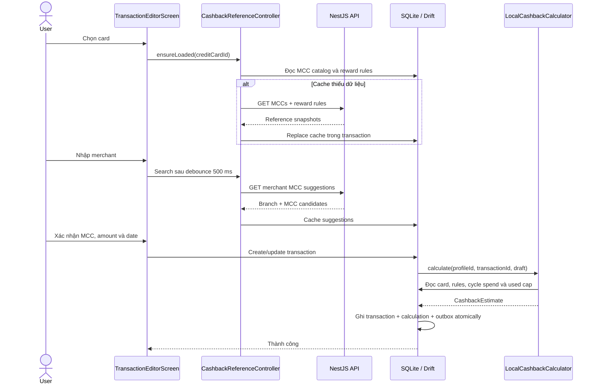

# Cashback Calculation Flow

**Status:** Implemented as a local estimate on mobile

**Last updated:** 2026-08-08

Tài liệu này mô tả cách cashback đang thực sự hoạt động trong code hiện hữu.
Nó không mô tả cashback chính thức trong tương lai như thể phần đó đã được
implement.

## 1. Phạm vi hiện tại

CardPilot hiện tính **cashback ước tính trên thiết bị** dựa trên:

- credit-card product được liên kết với thẻ local của user;
- MCC được user xác nhận khi tạo giao dịch;
- reward rules và MCC mappings đã cache trong SQLite;
- tổng chi tiêu và cashback đã tính trong billing cycle hiện tại.

Kết quả local giúp UI hoạt động offline và phản hồi ngay. Nó không phải số tiền
do ngân hàng xác nhận và backend chưa overwrite hoặc reconcile kết quả này.

```text
Authoritative cashback from bank/backend: chưa implement
Local mobile cashback estimate:          đã implement
```

## 2. Các thành phần chính

| Thành phần                          | Vai trò                                                                   |
| ----------------------------------- | ------------------------------------------------------------------------- |
| `CashbackReferenceController`       | Load MCC catalog, reward rules và merchant suggestions cho form giao dịch |
| `CashbackReferenceRepository`       | Cache-first orchestration giữa API và SQLite                              |
| `CashbackReferenceRemoteDataSource` | Gọi các read API liên quan tới MCC và reward rule                         |
| `CashbackReferenceLocalDataSource`  | Đọc/ghi MCC, reward rule, rule-MCC mapping và merchant candidate cache    |
| `TransactionEditorScreen`           | Thu thập card, merchant, MCC, số tiền và ngày giao dịch                   |
| `TransactionController`             | Điều phối create/update/delete transaction                                |
| `TransactionLocalDataSource`        | Ghi merchant, transaction, calculation và outbox trong SQLite transaction |
| `LocalCashbackCalculator`           | Chọn reward rule phù hợp và tính estimate                                 |
| `TransactionDetailsScreen`          | Hiển thị MCC, rate, rule, cashback và explanation                         |

Source code chính:

```text
apps/cardpilot-mobile/apps/cardpilot_app/lib/features/
  cashback_reference/
  transactions/
    data/services/local_cashback_calculator.dart
    data/datasources/transaction_local_data_source.dart
    presentation/views/transaction_editor_screen.dart
    presentation/views/transaction_details_screen.dart
```

## 3. Dữ liệu reference được lấy từ đâu

Mobile đang sử dụng các endpoint public sau:

| Endpoint                                              | Dữ liệu                                             |
| ----------------------------------------------------- | --------------------------------------------------- |
| `GET /api/v1/merchant-category-codes`                 | MCC catalog đang active                             |
| `GET /api/v1/credit-cards/:creditCardId/reward-rules` | Reward rules và MCC mappings của một card product   |
| `GET /api/v1/merchants/mcc-suggestions?query=...`     | Merchant/branch MCC suggestions                     |
| `GET /api/v1/merchants`                               | Merchant directory, branch và MCC theo payment type |

Reference data được lưu vào:

| SQLite table                    | Nội dung                                             |
| ------------------------------- | ---------------------------------------------------- |
| `merchant_category_codes_cache` | MCC code, description và category                    |
| `reward_rules_cache`            | Rate, cap, minimum spend, effective dates và channel |
| `reward_rule_mccs_cache`        | MCC eligible/excluded của từng rule                  |
| `merchant_mcc_candidates_cache` | Merchant/branch MCC suggestions và confidence        |
| `merchant_branches_cache`       | Merchant directory dùng cho browsing offline         |

`CashbackReferenceRepository.ensureLoaded(creditCardId)` đọc SQLite trước. Nếu
cả MCC catalog và rules của card đã có thì không gọi API. Nếu thiếu một trong
hai, repository tải lại MCC catalog và rules, ghi chúng vào SQLite, rồi trả dữ
liệu được đọc lại từ SQLite.

Hiện cache bootstrap dùng `dataset_version = 1`. Manifest/ETag và refresh dữ
liệu đã cache bằng `Sync Now` chưa được implement.

## 4. Flow khi tạo hoặc chỉnh sửa giao dịch



### 4.1 Chọn card

Calculator cần `local_user_cards.credit_card_id`, tức ID của card product trên
cloud. Nếu thẻ local không liên kết với card product, kết quả là `0` và
explanation:

```text
This card is not linked to a card product.
```

### 4.2 Chọn merchant và MCC

Khi user nhập merchant:

1. Form debounce 500 ms.
2. Controller gọi merchant suggestion API.
3. Kết quả API được cache để có thể fallback khi API lỗi mạng.
4. Nếu chỉ có đúng một suggestion, form tự áp dụng merchant và MCC đó.
5. User vẫn có thể mở MCC picker để chọn suggestion khác, MCC eligible của thẻ,
   hoặc MCC bất kỳ trong catalog.

MCC cuối cùng do user xác nhận mới được đưa vào `TransactionDraft.mccCode` và
dùng để tính cashback. Tên merchant tự nó không quyết định cashback nếu chưa có
MCC.

`mccSource` hiện có thể là:

- `merchant_match`: MCC đến từ merchant candidate;
- `manual`: user tự chọn MCC.

Confidence của merchant candidate được truyền qua
`TransactionDraft.mccConfidencePpm`.

## 5. Thuật toán `LocalCashbackCalculator`

### Bước 1: Xác định card product

Calculator tìm thẻ theo đồng thời:

- `local_user_cards.id = draft.userCardId`;
- đúng `profile_id`;
- chưa bị soft-delete.

Sau đó dùng `credit_card_id` để đọc active reward rules trong SQLite.

Nếu không có cached rule, estimate bằng `0` với explanation rằng rule chưa khả
dụng.

### Bước 2: Xác định billing cycle

Billing cycle dùng `billing_cycle_day` của thẻ:

```text
transactionAt >= boundary tháng hiện tại
  => [boundary tháng hiện tại, boundary tháng sau)

transactionAt < boundary tháng hiện tại
  => [boundary tháng trước, boundary tháng hiện tại)
```

Ngày 29–31 được clamp về ngày cuối cùng của tháng ngắn hơn. Ví dụ billing day
31 trong tháng 2 sẽ dùng ngày cuối tháng 2.

### Bước 3: Tính cycle spend

Calculator cộng tất cả transaction chưa bị xoá của cùng thẻ trong cycle, không
phân biệt MCC, rồi cộng amount của draft hiện tại:

```text
monthlySpend = priorCycleSpend + currentTransactionAmount
```

Khi edit, transaction đang edit bị loại khỏi `priorCycleSpend` bằng
`transactionId`, tránh cộng hai lần.

### Bước 4: Lọc reward rule

Một rule chỉ được xét khi thỏa toàn bộ điều kiện hiện tại:

1. `rewardType == cashback`;
2. có `cashbackRate`;
3. ngày giao dịch nằm trong `effectiveFrom` và `effectiveTo`, tính inclusive;
4. `eligibleChannel == any`;
5. MCC không nằm trong mapping `excluded` hoặc `ineligible`;
6. nếu rule có eligible mappings, MCC giao dịch phải xuất hiện trong mappings;
7. rule đang active trong cache.

Nếu rule không có eligible MCC mapping nào, calculator coi rule đó là general
rule và cho phép mọi MCC không bị exclude.

### Bước 5: Kiểm tra minimum conditions

Nếu amount nhỏ hơn `minimumTransactionAmount`, rule vẫn tạo một candidate với
cashback `0` và explanation tương ứng.

Nếu tổng cycle spend chưa đạt `minimumMonthlySpend`, rule cũng tạo candidate
cashback `0`.

### Bước 6: Tính cashback thô

Rate được đổi sang parts-per-million để hạn chế sai số khi nhân tiền:

```text
ratePpm = round(cashbackRate × 1,000,000)

rawCashback = round(
  transactionAmount × ratePpm / 1,000,000
)
```

Ví dụ:

```text
Amount:       100,000 VND
Rate:         5% = 0.05 = 50,000 ppm
Raw cashback: 5,000 VND
```

VND có exponent 0 trong implementation hiện tại nên `amountMinor` đang tương
đương số đồng VND nguyên.

### Bước 7: Áp dụng monthly cap

Nếu rule có `monthlyCapAmount`, calculator cộng cashback local đã dùng bởi:

- cùng user card;
- cùng reward rule;
- cùng billing cycle;
- transaction chưa bị xoá;
- không bao gồm transaction hiện đang edit.

Sau đó:

```text
remainingCap = max(0, monthlyCap - usedCashback)
estimated    = min(rawCashback, remainingCap)
```

### Bước 8: Chọn rule tốt nhất

Calculator đánh giá tất cả rule hợp lệ rồi chọn candidate có
`amountMinor` lớn nhất. Hiện tại không stack nhiều reward rules trong một giao
dịch.

Nếu không có rule phù hợp, estimate là `0`, confidence là `0`, và explanation
nêu MCC không match active cashback rule nào.

## 6. Confidence hoạt động như thế nào

Confidence được lưu dưới dạng ppm từ `0` đến `1,000,000`:

```text
calculationConfidence = min(ruleConfidence, mccConfidence)
```

Nếu một phía không có confidence, code hiện coi phía đó là `1,000,000` (100%).
Vì vậy confidence không phải xác suất được hiệu chỉnh thống kê; nó chỉ là chỉ
báo độ tin cậy tương đối từ dữ liệu rule và MCC hiện có.

## 7. Ghi SQLite và tính atomic

Create/update transaction chạy trong một Drift transaction duy nhất. Các bước
chính gồm:

1. tìm hoặc tạo `local_merchants`;
2. tính `CashbackEstimate`;
3. insert/update `local_transactions`;
4. xoá calculation local cũ của transaction nếu đang edit;
5. insert `local_cashback_calculations` mới;
6. insert mutation vào `sync_outbox`.

Nếu một bước thất bại, toàn bộ thay đổi rollback.

Việc bootstrap reference cache không dùng chung transaction với transaction
của user: MCC snapshot và reward-rule snapshot hiện được replace bằng các Drift
transaction riêng trước khi user lưu giao dịch.

### `local_transactions`

Lưu snapshot cần hiển thị nhanh:

- `mcc_code`;
- `mcc_source`;
- `cashback_estimated_minor`;
- `cashback_confidence_ppm`.

### `local_cashback_calculations`

Lưu breakdown chi tiết:

- `reward_rule_id`;
- `estimated_cashback_minor`;
- `applied_rate_ppm`;
- `confidence_ppm`;
- `explanation`;
- `status = estimated`;
- `calculation_source = local`.

Unique key `(transaction_id, calculation_source)` đảm bảo mỗi transaction chỉ
có một local calculation hiện hành và sau này có thể có thêm một server
calculation riêng.

Outbox payload hiện không gửi local cashback estimate. Đây là chủ ý đúng: khi
backend sync được implement, backend phải tự tính hoặc xác nhận cashback thay vì
tin tuyệt đối vào số do client gửi lên.

## 8. Hiển thị trên UI

`transactionsProvider(profileId)` watch query join:

- `local_transactions`;
- `local_user_cards`;
- `local_merchants`;
- local cashback calculation;
- cached reward rule.

Danh sách Transactions hiển thị amount và estimated cashback. Trang Transaction
Details hiển thị:

- merchant;
- card;
- thời gian;
- category;
- MCC;
- estimated cashback;
- applied rate;
- reward rule name;
- calculation explanation.

Home tính tổng `cashbackEstimatedMinor` của các transaction thuộc billing cycle
hiện tại cho từng thẻ, sau đó cộng các thẻ để hiển thị trong `Cashback Progress`.
Con số này vẫn mang nhãn `estimated` và được đọc hoàn toàn từ SQLite.

Khi transaction được edit, calculator chạy lại và thay local calculation cũ.
Khi transaction bị xoá, transaction được soft-delete; các phép cộng cycle spend
và monthly cap bỏ qua transaction đã xoá.

## 9. Merchant payment type và transaction channel

Merchant directory đã có `paymentType`, ví dụ:

- `in_store`;
- `online`;
- `shopee_food`;
- `grab_food`.

Tuy nhiên, transaction schema và `TransactionDraft` hiện chưa có payment
channel. Vì vậy payment type user thấy trong Merchant directory chưa được
truyền vào calculator.

Hệ quả hiện tại:

- calculator chỉ xét rule có `eligibleChannel = any`;
- rule dành riêng cho online, contactless, ShopeeFood hoặc channel khác bị bỏ
  qua;
- hai MCC khác nhau vẫn có thể tạo estimate khác nhau nếu user chọn đúng MCC,
  nhưng calculator chưa match thêm điều kiện channel.

Đây là phần cần implement trước khi CardPilot có thể tính đúng các ưu đãi phụ
thuộc phương thức thanh toán.

## 10. Các giới hạn đã biết

1. Cashback chỉ là local estimate, chưa được backend/bank xác nhận.
2. Cache chưa có manifest/ETag refresh; rule cloud thay đổi chưa tự động cập nhật
   một cache đã có.
3. Chỉ `eligibleChannel = any` được tính.
4. Không stack nhiều rule; chỉ lấy rule tạo ra cashback lớn nhất.
5. Chưa có rule priority hoặc deterministic tie-breaker khi hai rule trả cùng
   amount.
6. Chưa model installment, contactless, wallet, payment gateway hoặc promotion
   campaign riêng.
7. Minimum monthly spend dùng toàn bộ spend của card trong cycle, không chỉ
   spend của riêng MCC/rule.
8. Cap được phân bổ theo các calculation đã tồn tại. Khi thêm/edit/xoá giao dịch
   cũ, các transaction khác trong cycle chưa được tự động recalculation, nên
   phân bổ cap có thể tạm thời phụ thuộc thứ tự tính.
9. Chưa xử lý refund, reversal, pending authorization hoặc amount âm.
10. Chưa có official server calculation để ghi row
    `calculation_source = server`.

## 11. Hướng implementation tiếp theo

### Phase A — hoàn thiện local calculator

1. Thêm `paymentChannel` vào transaction domain và SQLite migration.
2. Khi chọn merchant branch/payment type, truyền channel cùng MCC vào draft.
3. Match `reward_rules.eligible_channel` với transaction channel.
4. Thêm rule priority và tie-breaker rõ ràng.
5. Tạo cycle recalculation service; create/update/delete một transaction phải
   có thể tính lại các transaction bị ảnh hưởng bởi monthly spend/cap.
6. Bổ sung unit tests cho effective date, excluded MCC, minimum spend, cap,
   edit và billing day 29–31.

### Phase B — authoritative backend calculation

1. Backend verify Supabase identity và nhận transaction sync.
2. Backend dùng server-owned reward rules để tính lại.
3. API trả official calculation, rule version và explanation.
4. Mobile lưu kết quả bằng `calculation_source = server`.
5. UI phân biệt rõ `Estimated` và `Confirmed`.
6. Khi local/server khác nhau, server result thắng nhưng local result vẫn có thể
   được giữ cho diagnostics.

### Phase C — reference refresh

1. Implement reference-data manifest và ETag.
2. `Sync Now` so sánh dataset versions.
3. Replace MCC/rule snapshots atomically.
4. Recalculate các transaction bị ảnh hưởng khi rule version thay đổi.

## 12. Checklist khi thay đổi cashback code

- Không dùng floating-point để lưu money.
- Luôn scope transaction/card/calculation query bằng profile hoặc owner phù hợp.
- Create/update transaction và calculation phải nằm trong cùng SQLite
  transaction.
- Không gửi local estimate như một authoritative value lên backend.
- Nếu thêm rule condition mới, cập nhật cả parser, cache schema, calculator,
  explanation và tests.
- Nếu thay đổi billing-cycle hoặc cap logic, phải test edit/delete và ngày
  29–31.
- UI luôn ghi rõ đây là `Estimated cashback` cho tới khi server confirmation
  được implement.

## Related documents

- [Mobile Architecture](./MOBILE_ARCHITECTURE.md)
- [Mobile SQLite Architecture](./architecture/mobile-sqlite.md)
- [API Design](./architecture/api.md)
- [Database Design](./architecture/database.md)
- [MCC Migration Guide](./MCC_MIGRATION_GUIDE.md)
