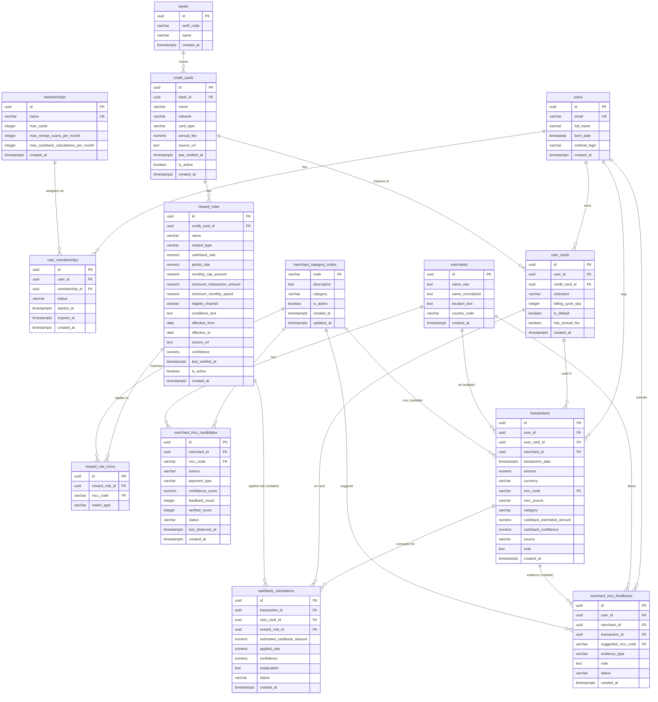

# Database Design Document

# CardPilot - Credit Card Cashback & Rewards Intelligence Platform

**Version:** 1.1
**Date:** 2026-08-03

> PostgreSQL schema source of truth is
> `apps/cardpilot-backend/src/database/migrations/1784410000000-create-initial-schema.ts`;
> reference rows are added once by
> `1784783921000-seed-reference-data.ts`. The `banks` context also has a
> TypeORM entity used by application code. When this prose differs from an
> applied migration, the migration wins and this document must be corrected.

---

## 1. Database Strategy Overview

| Database                     | Type              | Purpose                                               | Trạng thái                                                |
| ---------------------------- | ----------------- | ----------------------------------------------------- | --------------------------------------------------------- |
| PostgreSQL (Supabase-hosted) | Relational (OLTP) | Toàn bộ dữ liệu nghiệp vụ — source of truth           | Active (schema tồn tại, chưa có application code đọc/ghi) |
| SQLite (on-device, Flutter)  | Embedded          | Local-first user data + reference cache + sync outbox | Proposed with Drift — dependency/code chưa được thêm      |

Kết nối runtime dùng `DATABASE_URL` (khuyến nghị Supabase session pooler); migration CLI dùng `DIRECT_DATABASE_URL` (kết nối trực tiếp, fallback về `DATABASE_URL` nếu không có) — xem `apps/cardpilot-backend/src/database/data-source.ts`.

---

## 2. PostgreSQL - Core Schema

### 2.1 ERD Overview



### 2.2 Table Definitions Overview

The SQL listing below is an architectural overview, not executable migration
input. Common audit fields may be omitted from the diagram/listing for
readability. Always inspect
`1784410000000-create-initial-schema.ts` for exact current columns, defaults,
constraints, and drop order. In particular, the current migration includes
`updated_at`, `banks.short_name`, and
`merchant_category_codes.valid_payment`, which mobile cache mapping must handle
when those values are exposed by API DTOs.

```sql
-- =============================================
-- USERS & MEMBERSHIP
-- =============================================

CREATE TABLE "users" (
  "id" uuid PRIMARY KEY,
  "email" varchar NOT NULL UNIQUE,
  "full_name" varchar,
  "born_date" timestamp,
  "method_login" varchar,
  "created_at" timestamptz DEFAULT now()
);

CREATE TABLE "memberships" (
  "id" uuid PRIMARY KEY,
  "name" varchar NOT NULL UNIQUE,
  "max_cards" integer,
  "max_receipt_scans_per_month" integer,
  "max_cashback_calculations_per_month" integer,
  "created_at" timestamptz DEFAULT now()
);

CREATE TABLE "user_memberships" (
  "id" uuid PRIMARY KEY,
  "user_id" uuid NOT NULL,
  "membership_id" uuid NOT NULL,
  "status" varchar NOT NULL,
  "started_at" timestamptz NOT NULL,
  "expired_at" timestamptz,
  "created_at" timestamptz DEFAULT now(),
  CONSTRAINT "fk_user_memberships_user" FOREIGN KEY ("user_id")
    REFERENCES "users" ("id") DEFERRABLE INITIALLY IMMEDIATE,
  CONSTRAINT "fk_user_memberships_membership" FOREIGN KEY ("membership_id")
    REFERENCES "memberships" ("id") DEFERRABLE INITIALLY IMMEDIATE
);

-- =============================================
-- CARDS
-- =============================================

CREATE TABLE "banks" (
  "id" uuid PRIMARY KEY,
  "swift_code" varchar(20),
  "name" varchar(50) NOT NULL,
  "created_at" timestamptz DEFAULT now()
);

CREATE TABLE "credit_cards" (
  "id" uuid PRIMARY KEY,
  "bank_id" uuid NOT NULL,
  "name" varchar NOT NULL,
  "network" varchar,
  "card_type" varchar DEFAULT 'credit',
  "annual_fee" numeric(14,2),
  "source_url" text,
  "last_verified_at" timestamptz,
  "is_active" boolean DEFAULT true,
  "created_at" timestamptz DEFAULT now(),
  CONSTRAINT "fk_credit_cards_bank" FOREIGN KEY ("bank_id")
    REFERENCES "banks" ("id") DEFERRABLE INITIALLY IMMEDIATE
);

CREATE TABLE "user_cards" (
  "id" uuid PRIMARY KEY,
  "user_id" uuid NOT NULL,
  "credit_card_id" uuid NOT NULL,
  "nickname" varchar,
  "billing_cycle_day" integer,
  "is_default" boolean DEFAULT false,
  "has_annual_fee" boolean DEFAULT false,
  "created_at" timestamptz DEFAULT now(),
  CONSTRAINT "fk_user_cards_user" FOREIGN KEY ("user_id")
    REFERENCES "users" ("id") DEFERRABLE INITIALLY IMMEDIATE,
  CONSTRAINT "fk_user_cards_credit_card" FOREIGN KEY ("credit_card_id")
    REFERENCES "credit_cards" ("id") DEFERRABLE INITIALLY IMMEDIATE
);

-- =============================================
-- MCC & MERCHANTS
-- =============================================

CREATE TABLE "merchant_category_codes" (
  "code" varchar(4) PRIMARY KEY,
  "description" text NOT NULL,
  "category" varchar,
  "is_active" boolean DEFAULT true,
  "created_at" timestamptz DEFAULT now(),
  "updated_at" timestamptz DEFAULT now()
);

CREATE TABLE "merchants" (
  "id" uuid PRIMARY KEY,
  "name_raw" text NOT NULL,
  "name_normalized" text NOT NULL,
  "location_text" text,
  "country_code" varchar(2) DEFAULT 'VN',
  "created_at" timestamptz DEFAULT now()
);

CREATE TABLE "merchant_mcc_candidates" (
  "id" uuid PRIMARY KEY,
  "merchant_id" uuid NOT NULL,
  "mcc_code" varchar(4) NOT NULL,
  "source" varchar NOT NULL,
  "payment_type" varchar NOT NULL DEFAULT 'unknown',
  "confidence_score" numeric(4,3) DEFAULT 0,
  "feedback_count" integer DEFAULT 0,
  "verified_count" integer DEFAULT 0,
  "status" varchar DEFAULT 'suggested',
  "last_observed_at" timestamptz,
  "created_at" timestamptz DEFAULT now(),
  CONSTRAINT "fk_merchant_mcc_candidates_merchant" FOREIGN KEY ("merchant_id")
    REFERENCES "merchants" ("id") DEFERRABLE INITIALLY IMMEDIATE,
  CONSTRAINT "fk_merchant_mcc_candidates_mcc" FOREIGN KEY ("mcc_code")
    REFERENCES "merchant_category_codes" ("code") DEFERRABLE INITIALLY IMMEDIATE,
  CONSTRAINT "uq_merchant_mcc_candidates_merchant_mcc" UNIQUE ("merchant_id", "mcc_code")
);

-- =============================================
-- TRANSACTIONS
-- =============================================

CREATE TABLE "transactions" (
  "id" uuid PRIMARY KEY,
  "user_id" uuid NOT NULL,
  "user_card_id" uuid NOT NULL,
  "merchant_id" uuid,
  "transaction_date" timestamptz NOT NULL,
  "amount" numeric(14,2) NOT NULL,
  "currency" varchar(3) NOT NULL DEFAULT 'VND',
  "mcc_code" varchar(4),
  "mcc_source" varchar,
  "category" varchar,
  "cashback_estimated_amount" numeric(14,2),
  "cashback_confidence" numeric(4,3),
  "source" varchar DEFAULT 'manual',
  "note" text,
  "created_at" timestamptz DEFAULT now(),
  CONSTRAINT "fk_transactions_user" FOREIGN KEY ("user_id")
    REFERENCES "users" ("id") DEFERRABLE INITIALLY IMMEDIATE,
  CONSTRAINT "fk_transactions_user_card" FOREIGN KEY ("user_card_id")
    REFERENCES "user_cards" ("id") DEFERRABLE INITIALLY IMMEDIATE,
  CONSTRAINT "fk_transactions_merchant" FOREIGN KEY ("merchant_id")
    REFERENCES "merchants" ("id") DEFERRABLE INITIALLY IMMEDIATE,
  CONSTRAINT "fk_transactions_mcc" FOREIGN KEY ("mcc_code")
    REFERENCES "merchant_category_codes" ("code") DEFERRABLE INITIALLY IMMEDIATE
);

CREATE TABLE "merchant_mcc_feedbacks" (
  "id" uuid PRIMARY KEY,
  "user_id" uuid NOT NULL,
  "merchant_id" uuid NOT NULL,
  "transaction_id" uuid,
  "suggested_mcc_code" varchar(4) NOT NULL,
  "evidence_type" varchar,
  "note" text,
  "status" varchar DEFAULT 'pending',
  "created_at" timestamptz DEFAULT now(),
  CONSTRAINT "fk_merchant_mcc_feedbacks_user" FOREIGN KEY ("user_id")
    REFERENCES "users" ("id") DEFERRABLE INITIALLY IMMEDIATE,
  CONSTRAINT "fk_merchant_mcc_feedbacks_merchant" FOREIGN KEY ("merchant_id")
    REFERENCES "merchants" ("id") DEFERRABLE INITIALLY IMMEDIATE,
  CONSTRAINT "fk_merchant_mcc_feedbacks_transaction" FOREIGN KEY ("transaction_id")
    REFERENCES "transactions" ("id") DEFERRABLE INITIALLY IMMEDIATE,
  CONSTRAINT "fk_merchant_mcc_feedbacks_mcc" FOREIGN KEY ("suggested_mcc_code")
    REFERENCES "merchant_category_codes" ("code") DEFERRABLE INITIALLY IMMEDIATE
);

CREATE INDEX "idx_merchant_mcc_feedbacks_merchant_mcc"
  ON "merchant_mcc_feedbacks" ("merchant_id", "suggested_mcc_code");
CREATE INDEX "idx_merchant_mcc_feedbacks_user_merchant_transaction"
  ON "merchant_mcc_feedbacks" ("user_id", "merchant_id", "transaction_id");

-- =============================================
-- REWARD RULES & CASHBACK
-- =============================================

CREATE TABLE "reward_rules" (
  "id" uuid PRIMARY KEY,
  "credit_card_id" uuid NOT NULL,
  "name" varchar NOT NULL,
  "reward_type" varchar NOT NULL,
  "cashback_rate" numeric(6,4),
  "points_rate" numeric(10,4),
  "monthly_cap_amount" numeric(14,2),
  "minimum_transaction_amount" numeric(14,2),
  "minimum_monthly_spend" numeric(14,2),
  "eligible_channel" varchar DEFAULT 'any',
  "conditions_text" text,
  "effective_from" date,
  "effective_to" date,
  "source_url" text,
  "confidence" numeric(4,3),
  "last_verified_at" timestamptz,
  "is_active" boolean DEFAULT true,
  "created_at" timestamptz DEFAULT now(),
  CONSTRAINT "fk_reward_rules_credit_card" FOREIGN KEY ("credit_card_id")
    REFERENCES "credit_cards" ("id") DEFERRABLE INITIALLY IMMEDIATE
);

CREATE TABLE "reward_rule_mccs" (
  "id" uuid PRIMARY KEY,
  "reward_rule_id" uuid NOT NULL,
  "mcc_code" varchar(4) NOT NULL,
  "match_type" varchar NOT NULL,
  CONSTRAINT "fk_reward_rule_mccs_reward_rule" FOREIGN KEY ("reward_rule_id")
    REFERENCES "reward_rules" ("id") DEFERRABLE INITIALLY IMMEDIATE,
  CONSTRAINT "fk_reward_rule_mccs_mcc" FOREIGN KEY ("mcc_code")
    REFERENCES "merchant_category_codes" ("code") DEFERRABLE INITIALLY IMMEDIATE,
  CONSTRAINT "uq_reward_rule_mccs_rule_mcc_match" UNIQUE ("reward_rule_id", "mcc_code", "match_type")
);

CREATE TABLE "cashback_calculations" (
  "id" uuid PRIMARY KEY,
  "transaction_id" uuid NOT NULL,
  "user_card_id" uuid NOT NULL,
  "reward_rule_id" uuid,
  "estimated_cashback_amount" numeric(14,2),
  "applied_rate" numeric(6,4),
  "confidence" numeric(4,3),
  "explanation" text,
  "status" varchar DEFAULT 'estimated',
  "created_at" timestamptz DEFAULT now(),
  CONSTRAINT "fk_cashback_calculations_transaction" FOREIGN KEY ("transaction_id")
    REFERENCES "transactions" ("id") DEFERRABLE INITIALLY IMMEDIATE,
  CONSTRAINT "fk_cashback_calculations_user_card" FOREIGN KEY ("user_card_id")
    REFERENCES "user_cards" ("id") DEFERRABLE INITIALLY IMMEDIATE,
  CONSTRAINT "fk_cashback_calculations_reward_rule" FOREIGN KEY ("reward_rule_id")
    REFERENCES "reward_rules" ("id") DEFERRABLE INITIALLY IMMEDIATE
);
```

### 2.3 Ghi chú thiết kế quan trọng

- **Không có cột nào được enforce bằng Postgres CHECK/enum** ngoài FK constraints. Các cột "trông giống enum" hiện tại chỉ là `varchar` tự do: `user_memberships.status`, `credit_cards.network`/`card_type`, `merchant_mcc_candidates.source`/`status`, `transactions.mcc_source`/`source`, `merchant_mcc_feedbacks.evidence_type`/`status`, `reward_rules.reward_type`/`eligible_channel`, `reward_rule_mccs.match_type`, `cashback_calculations.status`. Khi build application layer, cân nhắc thêm CHECK constraint hoặc validate ở tầng service để tránh giá trị rác.
- `merchant_category_codes.code` là PK dạng `varchar(4)` (chính MCC code, VD "5812"), không phải UUID — khác với mọi bảng khác.
- Migration hiện tại có `updated_at` trên các bảng mutable. Backend DTO phải
  expose audit/version data một cách có chủ đích; không nên trả toàn bộ ORM row.
- Tất cả FK dùng `DEFERRABLE INITIALLY IMMEDIATE`.
- `transactions.source` mặc định `'manual'` — thiết kế đã chừa chỗ cho nguồn khác (`ocr`, `import`, ...) ở Phase 2 mà không cần đổi schema.

---

## 3. Local Database (SQLite, Mobile)

**Proposed, chưa implement.** `cardpilot_app/pubspec.yaml` chưa khai báo Drift
hoặc thư viện SQLite. Dữ liệu profile/thẻ của shared initial setup vẫn được giữ
bởi `InitialSetupMemoryDataSource` và mất khi app process kết thúc.

Thiết kế chi tiết đã được tách sang
[`mobile-sqlite.md`](./mobile-sqlite.md). Tài liệu đó là nguồn review cho:

- lựa chọn Drift và package/folder ownership;
- schema v1 cho multiple local profiles, active-profile state, common cache, user card, outbox và sync state;
- schema v2 cho merchant, transaction, cashback và conflict records;
- startup routing, account isolation và guest-to-account claim;
- dataset version/ETag refresh, push/pull sync và optimistic concurrency;
- migration workflow, required tests và implementation slices.

### 3.1 Local table summary

| Local table                        | Purpose                                                                   | Sync behavior                                           |
| ---------------------------------- | ------------------------------------------------------------------------- | ------------------------------------------------------- |
| `local_profiles`                   | Ranh giới dữ liệu guest/authenticated; nhiều account có thể tồn tại local | Link profile guest tới Supabase identity khi có account |
| `app_settings`                     | Installation ID và `active_profile_id` singleton                          | Local only                                              |
| `local_user_cards`                 | Thẻ user tạo trên thiết bị                                                | Push/upsert theo client-generated UUID                  |
| `local_transactions`               | Giao dịch manual/OCR                                                      | Outbox push theo client-generated UUID                  |
| `local_cashback_calculations`      | Kết quả dự tính để dashboard offline                                      | Server có quyền tính lại và overwrite                   |
| `banks_cache`                      | Danh mục ngân hàng read-only                                              | Pull snapshot theo server dataset version/ETag          |
| `credit_cards_cache`               | Danh mục sản phẩm thẻ read-only                                           | Pull snapshot theo server dataset version/ETag          |
| `merchant_category_codes_cache`    | Danh mục MCC read-only                                                    | Pull snapshot theo server dataset version/ETag          |
| `reward_rules_cache`               | Master data read-only                                                     | Pull theo server version                                |
| `merchant_branches_cache`          | Merchant/branch directory used for offline browsing                       | Pull complete server snapshot                           |
| `merchant_mcc_candidates_cache`    | MCC mapping by branch and payment type                                    | Pull complete server snapshot                           |
| `local_merchant_mcc_contributions` | Profile-scoped MCC contributions awaiting a future moderation contract    | Local only; no outbox yet                               |
| `sync_outbox`                      | Danh sách mutation chờ gửi                                                | Retry an toàn theo idempotency key                      |
| `sync_state`                       | Cursor, last sync time, dataset version và ETag                           | Local only                                              |

Mọi record user-generated cần client UUID, timestamps, tombstone,
`sync_status`, và `server_version`. Timestamp vật lý dùng UTC epoch milliseconds;
money dùng integer minor units. Chi tiết column/constraint/index nằm trong
`mobile-sqlite.md` và không được suy ra chỉ từ bảng tóm tắt này.

### 3.2 Delivery phases

1. Review/approve `mobile-sqlite.md`; thêm Drift foundation và migration v1.
2. Thay `InitialSetupMemoryDataSource` bằng Drift adapter cho
   profile/first card và restore `active_profile_id` khi startup.
3. Chuyển card management và transaction management sang local repositories;
   UI luôn đọc SQLite dù online hay offline.
4. Dùng `sync_outbox`; mỗi local mutation và outbox item được ghi trong cùng
   SQLite transaction.
5. Sau Supabase sign-in, gọi backend bootstrap rồi upload guest profile/cards
   theo batch idempotent.
6. Thêm transaction upload, pull cursor, tombstone delete và conflict handling.
7. MVP chỉ chạy orchestration khi user bấm `Sync Now`; automatic
   resume/network/background sync là quyết định sản phẩm về sau.

Reference-data cache (`memberships`, `banks`, `credit_cards`, MCC, reward rules)
uses the server-owned integer version in `reference_dataset_versions`; an API
may additionally expose an ETag derived from that version. Mobile stores the
received value in `sync_state`. When the user taps `Sync Now`, it fetches and
replaces only changed snapshots inside SQLite transactions. This detects
server-side deletion without relying only on `updated_at` timestamps.

### 3.3 Conflict policy

- Server là source of truth cho membership, reward rules, cashback chính thức
  và các field authorization.
- User-editable profile/card fields dùng latest accepted `updated_at`, nhưng
  backend kiểm tra `server_version` để phát hiện stale update.
- Transaction dùng immutable client UUID để deduplicate. Chỉnh sửa tạo version
  mới; xoá dùng tombstone thay vì hard delete trước khi tất cả device sync.
- Cashback/membership được backend tính lại; client values chỉ là estimate và
  không được dùng để cấp điểm/hạng.
- Batch sync nhận `idempotency_key`; retry cùng mutation không tạo duplicate.

---

## 4. Data Migration Strategy

| Migration File                                       | Mô tả                                                                                                                                                      |
| ---------------------------------------------------- | ---------------------------------------------------------------------------------------------------------------------------------------------------------- |
| `1784410000000-create-initial-schema.ts`             | Tạo toàn bộ 14 bảng PostgreSQL theo thứ tự dependency FK và các indexes/constraints ban đầu.                                                               |
| `1784783921000-seed-reference-data.ts`               | Seed banks và MCC reference data đúng một lần; có `down()` chỉ xoá các reference row thuộc migration.                                                      |
| `1785715200000-create-reference-dataset-versions.ts` | Tạo registry version cho common datasets và statement-level triggers tự tăng version khi memberships, banks, credit cards, MCC hoặc reward rules thay đổi. |
| `1786072168025-seed-msb-bank-data.ts`                | Seed các sản phẩm thẻ MSB, reward rules, MCC 5262 còn thiếu và mapping MCC cho từng rule.                                                                  |
| `1786170000000-add-merchant-payment-type.ts`         | Phân biệt MCC candidate theo payment type và thêm index cho merchant directory.                                                                            |
| `1786180000000-seed-coffee-merchants.ts`             | Seed Highlands, Starbucks và Phúc Long branch profiles cùng MCC candidate theo in-store/ShopeeFood/GrabFood; dữ liệu ở trạng thái suggested.               |

Chạy migration qua:

```bash
pnpm migration:show
pnpm migration:run
pnpm migration:revert
```

(dùng `apps/cardpilot-backend/src/database/data-source.ts` làm DataSource — ưu tiên `DIRECT_DATABASE_URL`, fallback `DATABASE_URL`.)

Khi thêm MCC master hoặc mapping MCC vào reward rule, làm theo
[`MCC_MIGRATION_GUIDE.md`](../MCC_MIGRATION_GUIDE.md).

### Backup Strategy

Chưa có quy trình backup riêng — phụ thuộc backup mặc định của Supabase (managed Postgres). Chưa có tài liệu/kiểm chứng về tần suất & retention thật của backup Supabase cho project này — **TBD**, cần xác nhận trong Supabase dashboard của dự án.

---

**Tài liệu liên quan:** [SRS](../SRS.md) · [API Design](./api.md) · [System Architecture](./system.md)
