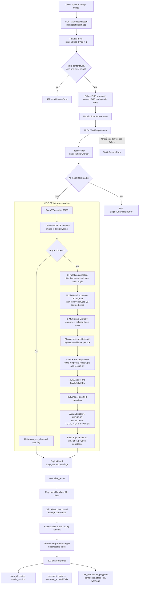
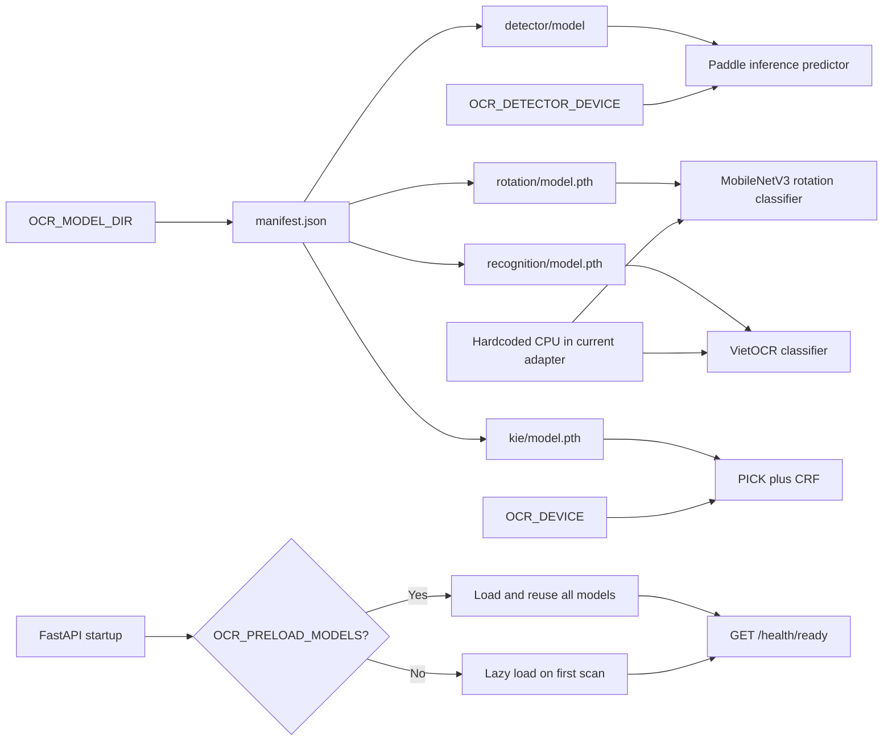
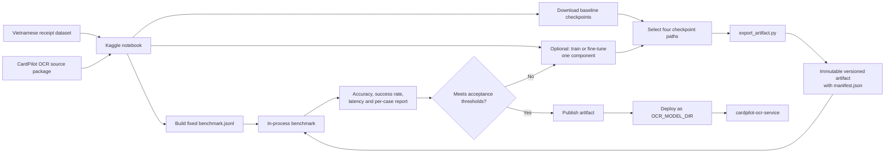
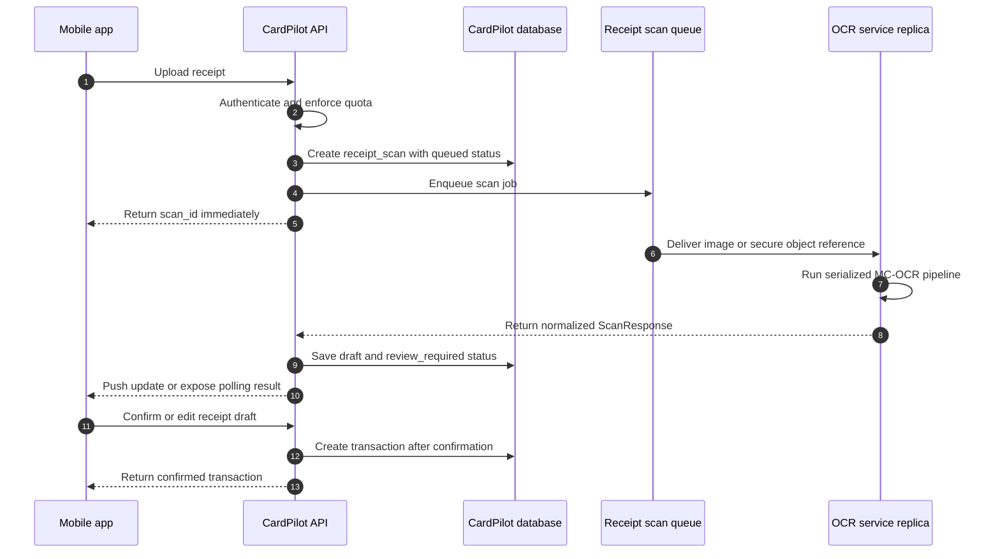

# CardPilot OCR Pipeline

Tai lieu nay mo ta pipeline OCR hien tai cua `cardpilot-ocr-service`. So do dau tien phan anh
runtime da duoc implement. So do cuoi la flow tich hop production duoc khuyen nghi, chua phai toan
bo deu da co trong CardPilot API.

Chi tiet vai tro cua PaddleOCR DB, CRAFT, VietOCR, PICK va normalization nam trong
[OCR technology](ocr-technology.md).

## 1. Runtime inference da implement

## 2. Model loading va device

Trong Kaggle benchmark v9, Paddle detector chay CPU trong virtualenv rieng. Rotation va VietOCR
cung dang chay CPU theo code adapter hien tai; chi PICK chay CUDA bang Torch cua Kaggle. Production
co the dung device khac sau khi adapter va Docker image dong bo duoc Paddle, Torch va CUDA.

## 3. Research va artifact lifecycle

## 4. Production integration target

Flow nay la kien truc duoc khuyen nghi trong README. Queue, object storage va CardPilot job API
nam ngoai FastAPI OCR service va can duoc implement trong backend CardPilot.

OCR output la draft. CardPilot khong nen tao transaction tu dong truoc khi nguoi dung xac nhan
merchant, ngay giao dich va tong tien.
