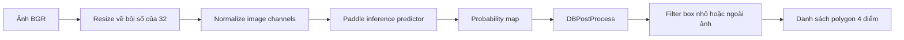
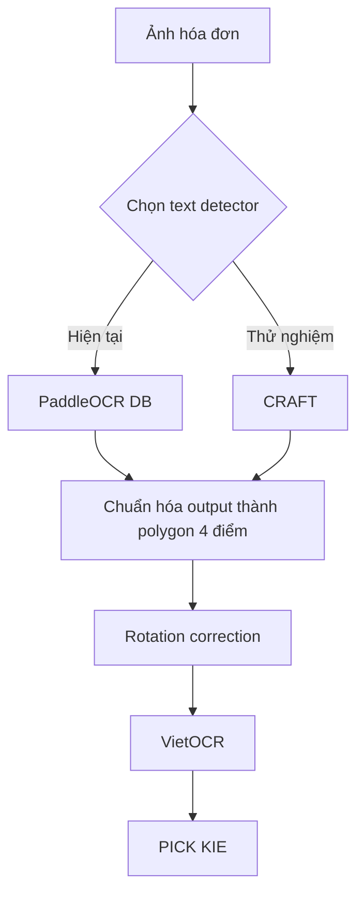
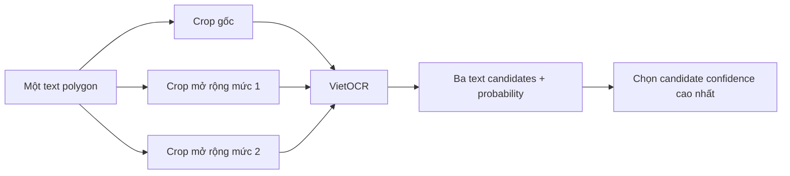
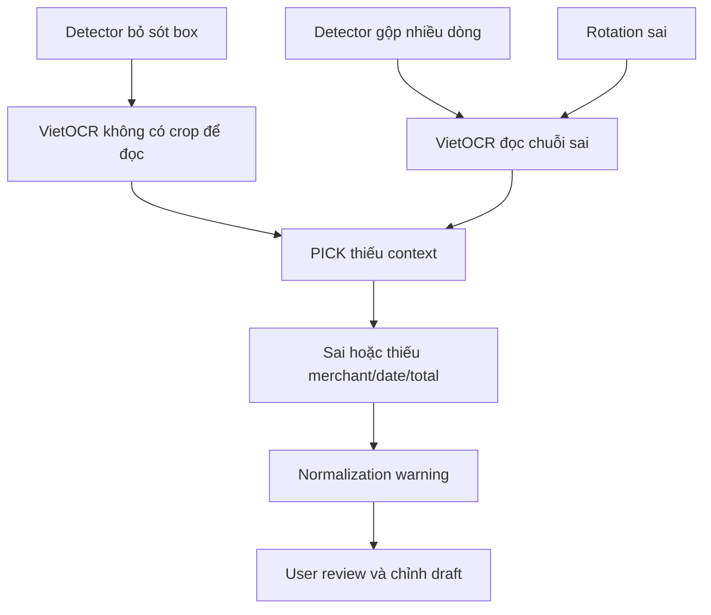

# Công nghệ OCR và luồng parse hóa đơn CardPilot

## Tổng quan

Pipeline hiện tại không dùng một model duy nhất để biến ảnh thành JSON. Nó chia bài toán thành bốn
stage machine learning và một stage chuẩn hóa bằng code:

```mermaid
flowchart LR
    A["Ảnh hóa đơn"] --> B["Text detection<br/>PaddleOCR DB"]
    B --> C["Các polygon chứa chữ"]
    C --> D["Deskew và page rotation<br/>geometry + MobileNetV3"]
    D --> E["Text recognition<br/>VietOCR VGG19-BN + Seq2Seq"]
    E --> F["Text + confidence + polygon"]
    F --> G["Key Information Extraction<br/>PICK + CRF"]
    G --> H["SELLER / ADDRESS /<br/>TIMESTAMP / TOTAL_COST"]
    H --> I["Rule-based normalization"]
    I --> J["merchant, address,<br/>occurred_at, total VND"]
```



Điểm cần phân biệt:

- **OCR** gồm text detection và text recognition: tìm chữ ở đâu và đọc chữ đó là gì.
- **KIE** xác định ý nghĩa của từng đoạn chữ: tên cửa hàng, địa chỉ, ngày hay tổng tiền.
- **Business parsing** chuyển kết quả KIE thành schema ổn định của CardPilot.

VietOCR chỉ giải quyết bước đọc chữ. Nó không tự tìm vị trí chữ trên toàn hóa đơn và cũng không biết
chuỗi `120.000` là tổng tiền hay một giá trị khác.

## 1. Image preprocessing

FastAPI nhận ảnh JPEG, PNG hoặc WebP qua `POST /v1/receipts/scan`. Trước khi chạy model, service:

1. Kiểm tra content type, dung lượng upload và tổng số pixel.
2. Dùng Pillow để áp dụng EXIF orientation.
3. Chuyển ảnh sang RGB.
4. Encode lại thành JPEG chuẩn để các stage sau nhận input nhất quán.
5. Dùng OpenCV decode JPEG thành ma trận ảnh BGR.

Output của bước này là ảnh đã được chuẩn hóa, chưa có text hay field nghiệp vụ.

## 2. Text detection: PaddleOCR DB

Implementation hiện tại dùng model `ch_ppocr_server_v2.0_det_infer` với thuật toán DB
(Differentiable Binarization), không dùng CRAFT. DB xem text detection như bài toán segmentation,
sau đó threshold và hậu xử lý probability map thành các polygon vùng chữ. PaddleOCR mô tả DB là
detector dùng differentiable binarization cho text detection thời gian thực.

Các tham số runtime hiện tại:

| Tham số | Giá trị | Ý nghĩa |
| --- | ---: | --- |
| `det_limit_side_len` | `960` | Giới hạn cạnh dài trước inference |
| `det_db_thresh` | `0.3` | Threshold probability map |
| `det_db_box_thresh` | `0.3` | Loại polygon có score thấp |
| `det_db_unclip_ratio` | `1.6` | Mở rộng polygon sau threshold |

Flow của detector:



Detector không đọc nội dung. Output của nó chỉ trả lời: **vùng nào trong ảnh có khả năng chứa chữ?**

Nguồn tham khảo: [PaddleOCR DB documentation](https://www.paddleocr.ai/v2.10.0/en/algorithm/text_detection/algorithm_det_db.html).

### CRAFT sẽ nằm ở đâu?

CRAFT là một detector khác. Nó dự đoán region score cho từng ký tự và affinity score thể hiện liên
kết giữa các ký tự, nhờ đó có thể mô hình hóa text cong, nghiêng hoặc biến dạng. Nếu dùng CRAFT,
nó chỉ thay thế stage PaddleOCR DB; rotation, VietOCR, PICK và normalization phía sau vẫn giữ nguyên.



Để tích hợp CRAFT vào code hiện tại, adapter mới cần giữ contract tương đương `TextDetector`:

```text
input:  OpenCV image
output: array of quadrilateral polygons + detector latency
```

Không nên đổi sang CRAFT chỉ dựa trên benchmark công khai. Cần đo trên tập receipt CardPilot với:

- Detection precision, recall và Hmean.
- Recall của text nhỏ, text mờ và hóa đơn bị nghiêng.
- Số polygon bị tách hoặc gộp sai.
- End-to-end field accuracy sau PICK, không chỉ detection accuracy.
- Latency, RAM và GPU memory.

Nguồn tham khảo: [CRAFT paper](https://arxiv.org/abs/1904.01941).

## 3. Rotation correction

Sau detection, service sửa hướng ảnh theo hai lớp:

1. Dùng hình học của các polygon để loại box bất thường và ước lượng góc nghiêng trung bình.
2. Crop từng vùng chữ rồi dùng MobileNetV3 phân loại `0` hoặc `180` độ.
3. Lấy voting của các crop để quyết định xoay cả trang.
4. Lọc lại các box 90 độ không phù hợp.

Bước này quan trọng vì VietOCR nhận từng dòng text. Crop bị ngược hoặc lệch góc làm recognition
confidence giảm, và lỗi đó tiếp tục truyền sang PICK.

## 4. Text recognition: VietOCR

VietOCR nhận **một crop chứa text**, không nhận toàn bộ hóa đơn. Cấu hình đang dùng trong CardPilot:

| Thành phần | Cấu hình hiện tại |
| --- | --- |
| CNN backbone | `vgg19_bn` |
| Sequence model | `seq2seq` |
| Encoder/decoder hidden size | `256` |
| Beam search | Tắt |
| Vocabulary | Ký tự tiếng Việt, số và dấu câu |
| Checkpoint | `recognition/model.pth` |

Với mỗi polygon, service tạo ba crop có mức mở rộng theo chiều dọc khác nhau. Cả ba crop được đưa
qua VietOCR; kết quả có probability cao nhất được chọn làm text cuối cùng cho box đó.



Output sau VietOCR gồm text, probability và polygon gốc. Adapter hiện tại truyền `gpu=None`, vì
vậy VietOCR đang chạy CPU dù PICK có thể chạy CUDA.

## 5. Key Information Extraction: PICK

PICK là stage biến OCR text thành field có nghĩa. Service tạo workspace tạm gồm:

```text
images/receipt.jpg
transcripts/receipt.tsv
```

Mỗi dòng TSV chứa index, tám tọa độ polygon và text từ VietOCR. `PICKDataset` kết hợp:

- Text feature từ nội dung OCR.
- Visual feature từ ảnh.
- Tọa độ và quan hệ không gian giữa các box.
- Graph learning/convolution để mô hình hóa layout hóa đơn.
- CRF decoding để tạo chuỗi nhãn nhất quán.

Model trả các nhãn `SELLER`, `ADDRESS`, `TIMESTAMP`, `TOTAL_COST` hoặc không có nhãn nghiệp vụ.
PICK là phần thực hiện document understanding; nó không sửa lỗi chính tả từ VietOCR.

Nguồn tham khảo: [PICK paper](https://arxiv.org/abs/2004.07464).

## 6. Rule-based normalization

Kết quả PICK vẫn chưa phải response cuối. `normalize_result` thực hiện:

| Model label | CardPilot field | Xử lý |
| --- | --- | --- |
| `SELLER` | `merchant` | Ghép text của các block liên quan |
| `ADDRESS` | `address` | Ghép text theo thứ tự block |
| `TIMESTAMP` | `occurred_at` | Parse các format ngày/giờ được hỗ trợ |
| `TOTAL_COST` | `total` | Lấy chuỗi số tiền và chuẩn hóa về `Decimal` |

Confidence của field là trung bình confidence VietOCR của các block được PICK gắn nhãn. Service
đồng thời trả raw text, polygon, bounding box, latency từng stage và warning như
`merchant_not_detected`, `timestamp_not_parsed` hoặc `total_not_parsed`.

## 7. Lỗi truyền qua pipeline như thế nào?



Vì lỗi có tính dây chuyền, benchmark production phải đo cả field accuracy cuối cùng. Một detector
có Hmean tốt hơn chưa chắc làm `total_accuracy` tốt hơn nếu nó chia box không phù hợp với VietOCR
hoặc PICK.

## Kết luận cho CardPilot

Pipeline hiện tại là:

```text
PaddleOCR DB -> rotation correction -> VietOCR -> PICK -> normalization -> review draft
```

CRAFT chưa được implement. Nếu thử CRAFT, nên xây nó như một detector adapter thay thế và chạy A/B
benchmark với PaddleOCR DB trên cùng holdout manifest. VietOCR tiếp tục là recognizer tiếng Việt,
PICK tiếp tục là KIE model, còn normalization giữ API response ổn định cho mobile app.
