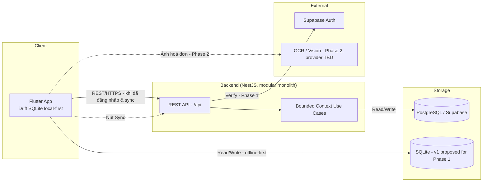

# Deployment Phases - Tổng Quan Roadmap Triển Khai
# CardPilot

**Version:** 1.0
**Date:** 2026-07-22

---

## Roadmap Overview

| Phase | Tên | Goal | Trạng thái |
|-------|-----|------|-----------|
| 1 | MVP — Local-first + Core Tracking | Auth cơ bản, local-only mode, CRUD thẻ, ghi log giao dịch thủ công, MCC/Card Rule seed + crowdsource cơ bản, Dashboard cốt lõi (Cashback Jar, Category pie chart) | In Progress (schema đã có, application layer chưa build) |
| 2 | Smart Tracking — OCR + Forecast | Recurring bill detection, OCR quét hoá đơn, notification Android, Spend Forecast + Card Recommendation, TensorFlow/OpenCV cho preview ảnh hoá đơn | Planned |

> Chỉ 2 phase được xác nhận rõ trong roadmap sản phẩm hiện tại (theo yêu cầu gốc từ team). Phase 3+ (Pro subscription, đa ngôn ngữ, v.v.) chưa được xác nhận — xem `BRD` #3.4, #8.

---

## Quy Ước Tham Chiếu

| Viết tắt | Tài liệu | Đường dẫn |
|----------|-----------|-----------|
| **BRD** | Business Requirements Document | `docs/BRD.md` |
| **PRD** | Product Requirements Document | `docs/PRD.md` |
| **SRS** | Software Requirements Specification | `docs/SRS.md` |
| **ARCH-SYS** | System Architecture | `docs/architecture/system.md` |
| **ARCH-API** | API Design Document | `docs/architecture/api.md` |
| **ARCH-DB** | Database Design Document | `docs/architecture/database.md` |
| **ARCH-AI** | AI/ML Architecture Document | `docs/architecture/ai.md` |
| **ARCH-DS** | Design System | `docs/architecture/design-system.md` |
| **ARCH-BACKEND** | Backend Architecture | `docs/BACKEND_ARCHITECTURE.md` |
| **ARCH-MOBILE** | Mobile Architecture | `docs/MOBILE_ARCHITECTURE.md` |
| **PROC-CICD** | DevOps & CI/CD Document | `docs/processes/devops-cicd.md` |

---

## Phase Summary

| Phase | Goal | Key Tables | Chi tiết |
|-------|------|------------|----------|
| 1 — MVP | Auth + Local-only mode + Card CRUD + Transaction Logging thủ công + MCC/Rule seed + Dashboard cốt lõi | `users`, `memberships`, `banks`, `credit_cards`, `user_cards`, `merchant_category_codes`, `merchants`, `reward_rules`, `reward_rule_mccs`, `transactions`, `cashback_calculations` | [→ phase-1](./deployment/deployment-phase-1.md) |
| 2 — Smart Tracking | OCR + Recurring Bill Detection + Spend Forecast + Card Recommendation + Notification (Android) | `merchant_mcc_candidates`, `merchant_mcc_feedbacks`, SQLite schema v2 transaction/reward tables | [→ phase-2](./deployment/deployment-phase-2.md) |

---

## Technology Evolution

| Component | Phase 1 | Phase 2 |
|-----------|---------|---------|
| Mobile | Flutter + Riverpod; proposed Drift schema v1 for workspace/setup/cards/reference cache | + Drift schema v2 transaction/reward tables, + OCR SDK, + push notification SDK (Android) |
| Backend | NestJS + Fastify + TypeORM + PostgreSQL (modular monolith, bounded contexts) | — (giữ nguyên kiến trúc, thêm bounded context mới) |
| Auth | Supabase Auth trên mobile; backend token verification/profile bootstrap còn pending | — |
| Database | PostgreSQL 17 + proposed SQLite v1 local-first foundation | + SQLite v2 transaction/reward cache migration |
| AI/ML | Rule-based MCC lookup (không cần model) | + OCR (on-device hoặc cloud, TBD), + OpenCV preprocessing, + Forecast heuristic |
| Infra | Docker Compose (chỉ Postgres local), Render (backend), Docker Hub (registry) | — (chưa có kế hoạch thay đổi hạ tầng) |
| CI/CD | GitHub Actions: build & deploy trên `develop` (backend + Widgetbook Cloud), chưa có CI trên PR | + CI lint/test trên PR (khuyến nghị, xem `PROC-CICD` Known Gap) |
| Monitoring | Nest `Logger` mặc định + health check (`@nestjs/terminus`) | Structured logging (khuyến nghị trước khi có user thật) |

---

## Database Evolution

| Table / Entity | Phase 1 | Phase 2 | Total Fields |
|----------------|---------|---------|--------------|
| users | New | — | 5 |
| memberships | New | — | 5 |
| user_memberships | New | — | 6 |
| banks | New | — | 3 |
| credit_cards | New | — | 8 |
| user_cards | New | — | 6 |
| merchant_category_codes | New | — | 5 |
| merchants | New | — | 4 |
| merchant_mcc_candidates | New (schema) | Đưa vào dùng đầy đủ qua OCR pipeline | 8 |
| transactions | New | +nguồn `source='ocr'` bắt đầu được ghi thật (field đã có sẵn, không cần migration mới) | 13 |
| merchant_mcc_feedbacks | New (schema) | Đưa vào dùng đầy đủ | 6 |
| reward_rules | New | — | 15 |
| reward_rule_mccs | New | — | 3 |
| cashback_calculations | New | — | 8 |
| **SQLite: workspace/profile/cards/reference/outbox** | Proposed v1 | Evolve through tested migrations | See `mobile-sqlite.md` |
| **SQLite: transactions/MCC/rewards/conflicts** | — | Proposed v2 | See `mobile-sqlite.md` |

**Tổng tables tích lũy:**

| Phase | New Tables (PG) | Modified | Cumulative |
|-------|----------------|----------|------------|
| 1 | 14 (schema migration + separate reference-data migration) | — | 14 |
| 2 | 0 (chỉ SQLite local, ngoài phạm vi Postgres) | 0 | 14 |

> Toàn bộ 14 bảng Postgres đã được tạo **cùng lúc** trong 1 migration (`1784410000000-create-initial-schema.ts`) trước khi có bất kỳ application code nào — khác với cách phát triển tăng dần table-theo-phase như dự án tham khảo khác. Bảng Database Evolution ở trên phản ánh **khi nào bảng được đưa vào SỬ DỤNG bởi tính năng thật**, không phải khi nào bảng được tạo trong Postgres.

---

## Data Flow Overview



> Diagram này là **logical view** — không thể hiện infrastructure chi tiết. Xem `ARCH-SYS` cho kiến trúc đầy đủ.

---

## Module × Phase Matrix

| Module | Phase 1 | Phase 2 |
|--------|---------|---------|
| User Management & Auth | Core: Register/Login/Logout/Forgot Password, Local-only mode | + Sync local → cloud |
| Membership | Core: hiển thị tier hiện tại, seed `memberships` | + Enforce giới hạn theo tier, công thức lên hạng |
| Card Management | Core: CRUD `user_cards`, seed `banks`/`credit_cards` | — |
| Card Rule Management | Core: seed/quản lý `reward_rules`/`reward_rule_mccs` (thu thập thủ công) | Enhancement: quy trình re-verify định kỳ |
| MCC Management | Core: seed `merchant_category_codes`, crowdsource cơ bản (`merchant_mcc_candidates`/`merchant_mcc_feedbacks`) | Enhancement: MCC inference tự động từ OCR |
| Transaction Logging | Core: nhập tay | + OCR, + Recurring bill detection |
| Dashboard | Core: Cashback Jar/Pocket, Category pie chart | + Spend Forecast, + Card Recommendation, + Card Usage & Refund Summary nâng cao |
| Notifications | — | Core: Push notification (Android) |
| AI/ML | Rule-based MCC lookup only | Core: OCR pipeline, OpenCV preprocessing, Forecast heuristic, Recommendation engine |

---

## Folder Structure

```
PP_CardPilot/
├── docs/                         # Tài liệu (file này + toàn bộ BRD/PRD/SRS/ARCH-*)
│   ├── template/                 # Templates cho mọi loại tài liệu (xem docs/template/README.md)
│   ├── architecture/             # ARCH-SYS, ARCH-API, ARCH-DB, ARCH-AI, ARCH-DS
│   └── processes/
│       ├── deployment-phases.md       # ← File này (overview)
│       ├── deployment/                # Chi tiết từng phase
│       │   ├── deployment-phase-1.md
│       │   └── deployment-phase-2.md
│       └── devops-cicd.md
├── apps/
│   ├── cardpilot-backend/        # NestJS + Fastify + TypeORM
│   ├── cardpilot-backend-e2e/
│   └── cardpilot-mobile/
│       ├── apps/cardpilot_app/          # Flutter production app
│       ├── apps/cardpilot_widgetbook/   # UI preview app
│       └── packages/cardpilot_ui/       # Shared design system
├── tools/dev-picker/              # CLI chọn service để chạy dev
└── compose.yaml                   # Local infra (Postgres only)
```
