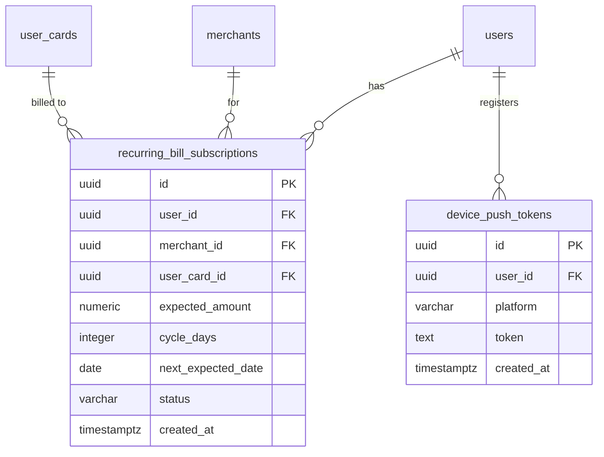

# Phase 2 - Smart Tracking: OCR + Forecast + Notifications
# CardPilot

**Status:** Planned
**Timeline:** TBD — chưa có cam kết thời gian chính thức
**Goal:** Giảm công sức ghi log thủ công (OCR), chủ động cảnh báo user trước khi vượt hạn mức hoàn tiền (Forecast + Card Recommendation), phát hiện chi tiêu định kỳ, và cho phép dùng app hoàn toàn offline với đồng bộ 2 chiều lên cloud
**User Scale:** TBD

---

## 1. Technology Stack

| Component | Technology |
|-----------|-----------|
| Mobile | Flutter — bổ sung: package SQLite (`sqflite`/`drift`, chưa chọn), package OCR (on-device ML Kit hay cloud API — chưa chọn), package push notification (FCM — chưa tích hợp) |
| Backend | NestJS — bổ sung bounded context mới cho recurring bills, forecast, recommendation, device token |
| Local Cache | SQLite on-device — bảng mới, xem #3.7 |
| AI/ML | OpenCV (preprocessing ảnh hoá đơn), OCR engine (chưa chọn provider — xem `ARCH-AI` #7), heuristic forecast (không cần ML model thật sự ở giai đoạn này) |
| Notification | Firebase Cloud Messaging (khả năng cao, chưa xác nhận) |

---

## 2. Screens

| # | Screen | Mô tả | Depends On |
|---|--------|--------|-----------|
| S14 | Receipt Scan | Camera capture hoặc chọn ảnh từ gallery hoá đơn | Phase 1 S09 |
| S15 | Receipt Preview & Confirm | Hiển thị kết quả OCR (merchant, amount, date) đã điền sẵn, cho phép sửa trước khi lưu; hiển thị preview ảnh đã qua OpenCV preprocessing | S14 |
| S16 | Recurring Bills List | Danh sách giao dịch định kỳ được phát hiện, user xác nhận là subscription thật hay bỏ qua | Phase 1 S10 |
| S17 | Notification Settings | Bật/tắt loại thông báo (cảnh báo hạn mức, nhắc bill định kỳ) | Phase 1 S12 |
| S18 | Spend Forecast (Dashboard widget) | Hiển thị dự đoán chi tiêu/hoàn tiền còn lại trong chu kỳ, cảnh báo nếu sắp vượt hạn mức | Phase 1 S06 |
| S19 | Card Recommendation (Dashboard modal/card) | Khi 1 category hết hạn mức hoàn tiền → hiển thị gợi ý đổi/thêm thẻ | S18 |
| S20 | Sync Settings | Nút "Đăng nhập để đồng bộ" cho user đang ở local-only mode, hiển thị trạng thái đồng bộ | Phase 1 S12 |

---

## 3. Database / ERD

### 3.1. ERD Reference

| Source | Section | Mô tả |
|--------|---------|--------|
| **ARCH-DB** | #3 (Local Cache Schema) | Local SQLite tables (đề xuất) |
| **ARCH-AI** | #2, #4, #5, #6 | Capability overview + pipeline cho OCR/Forecast/Recommendation/Recurring Bill |
| **SRS** | FR-TXN-05/06, FR-DASH-03/04 | Requirement liên quan |

### 3.2. ERD Diagram (bảng mới đề xuất cho Phase 2)



### 3.3. Tables / Entities

| # | Table / Entity | Change Type | Mô tả | Key Fields | Relationships | Ref |
|---|----------------|-------------|--------|------------|---------------|-----|
| T01 | `recurring_bill_subscriptions` | New | Lưu giao dịch định kỳ đã được user xác nhận là subscription | id (PK, uuid), user_id (FK), merchant_id (FK), user_card_id (FK), expected_amount, cycle_days, next_expected_date, status (enum đề xuất: `pending_confirmation`/`confirmed`/`ignored`) | → users, merchants, user_cards (FK) | ARCH-AI #6 |
| T02 | `device_push_tokens` | New | Token thiết bị để gửi push notification | id (PK, uuid), user_id (FK), platform (`android`), token (text), created_at | → users (FK, CASCADE) | PRD Phase 2 |

> Đây là 2 bảng **đề xuất mới** — chưa có migration nào được tạo. Cần review cùng team trước khi viết migration thật.

### 3.4. Indexes & Constraints

| Table | Index / Constraint | Type | Columns | Mục đích |
|-------|--------------------|------|---------|----------|
| `recurring_bill_subscriptions` | `idx_recurring_bills_user_next` | INDEX | `(user_id, next_expected_date)` | Query bill sắp tới để nhắc nhở |
| `device_push_tokens` | `uq_device_push_tokens_token` | UNIQUE | `(token)` | Tránh đăng ký trùng token |

### 3.5. Migration Notes

- **Create order**: `recurring_bill_subscriptions` → `device_push_tokens` (không phụ thuộc lẫn nhau, cả hai phụ thuộc `users`).
- **Seed data**: không cần.
- **Breaking changes**: N/A — chỉ thêm bảng mới, không sửa bảng Phase 1.

### 3.6. Data Volume & Retention

| Table | Ghi chú |
|-------|---------|
| `recurring_bill_subscriptions` | Nhỏ — vài chục record/user, retention vô thời hạn |
| `device_push_tokens` | 1 record/thiết bị, cần xoá khi user gỡ app hoặc logout (chưa thiết kế cơ chế detect) |

### 3.7. SQLite schema v2 — transactions and reward intelligence

| Local Table (SQLite) | Nguồn (Postgres) | Sync Direction | Conflict Resolution | Mục đích |
|-----------------------|-------------------|-----------------|----------------------|----------|
| `local_transactions` | `transactions` | Device ↔ Server through outbox/pull cursor | Client UUID dedupe; stale mutable update becomes explicit conflict | Ghi log giao dịch offline |
| `local_user_cards` | `user_cards` | Device ↔ Server | Optimistic `server_version`; do not silently drop a conflict | Quản lý thẻ offline; table begins in schema v1 |
| `reward_rules_cache` | `reward_rules` + `reward_rule_mccs` | Server → Device snapshot | Server dataset version/ETag wins | Tính cashback ngay cả khi offline |
| `local_cashback_calculations` | `cashback_calculations` | Local estimate; server may replace | Server authoritative for official result | Hiển thị Cashback Jar khi offline |

Full physical fields, scaled money/rate rules, migration tests, and conflict
records are defined in `docs/architecture/mobile-sqlite.md`.

---

## 4. API Endpoints

### Sync (2)

| Method | Endpoint | Auth | Related Tables | Mô tả |
|--------|----------|------|-----------------|--------|
| POST | `/api/v1/sync/push` | Supabase Bearer | User-owned tables (W) | Đẩy ordered outbox batch, trả accepted/conflict theo operation |
| GET | `/api/v1/sync/pull?cursor=...` | Supabase Bearer | User-owned tables (R) | Pull server changes bằng opaque cursor |

### OCR / Receipt (2)

| Method | Endpoint | Auth | Related Tables | Mô tả |
|--------|----------|------|-----------------|--------|
| POST | `/api/receipts/scan` | Bearer | — | Upload ảnh hoá đơn → trả kết quả OCR đã parse (merchant, amount, date) để user xác nhận. Không tự tạo `transactions` — chỉ tạo sau khi user confirm qua `POST /api/transactions` (Phase 1) với `source='ocr'` |
| GET | `/api/receipts/:id/status` | Bearer | — | Trạng thái xử lý (nếu OCR xử lý bất đồng bộ) |

### Recurring Bills (3)

| Method | Endpoint | Auth | Related Tables | Mô tả |
|--------|----------|------|-----------------|--------|
| GET | `/api/recurring-bills/candidates` | Bearer | `transactions` (R) | Chạy detection heuristic, trả về ứng viên chưa xác nhận |
| POST | `/api/recurring-bills` | Bearer | `recurring_bill_subscriptions` (W) | User xác nhận 1 candidate là subscription thật |
| PATCH | `/api/recurring-bills/:id` | Bearer | `recurring_bill_subscriptions` (RW) | Sửa/huỷ subscription |

### Forecast & Recommendation (2)

| Method | Endpoint | Auth | Related Tables | Mô tả |
|--------|----------|------|-----------------|--------|
| GET | `/api/dashboard/forecast` | Bearer | `transactions` (R), `reward_rules` (R) | Dự đoán chi tiêu/hoàn tiền theo ngày/tháng/năm |
| GET | `/api/dashboard/card-recommendation` | Bearer | `user_cards` (R), `reward_rules` (R), `credit_cards` (R) | Gợi ý thẻ khi 1 category hết hạn mức |

### Push Notifications (1)

| Method | Endpoint | Auth | Related Tables | Mô tả |
|--------|----------|------|-----------------|--------|
| POST | `/api/notifications/device-token` | Bearer | `device_push_tokens` (W) | Đăng ký device token để nhận push |

> **Convention**: `(R)` = Read, `(W)` = Write, `(RW)` = Read + Write

**Total: 10 endpoints (Planned)**
**Cumulative (Phase 1→2): 41 endpoints**

---

## 5. Task Breakdown

### Epic 1: Local-first Sync

| ID | Task | Mô tả | Deps | DB Migration | Ref Docs |
|----|------|--------|------|--------------|----------|
| T-001 | Chọn package SQLite | So sánh `sqflite` vs `drift`, quyết định dựa trên nhu cầu query phức tạp (Cashback Jar aggregation cần query tương đối) | — | — | ARCH-DB #3 |
| T-002 | Local schema Flutter | Tạo local tables tương ứng #3.7 trong `cardpilot_app` | T-001 | — (SQLite, không phải Postgres) | ARCH-DB #3 |
| T-003 | Thiết kế conflict resolution | **Quyết định kiến trúc quan trọng nhất Phase 2** — xác định cơ chế chống gian lận điểm/hoàn tiền khi sync, chiến lược xử lý trùng lặp giao dịch | — | — | BRD #9, ARCH-DB #3 |
| T-004 | POST /api/sync/transactions | Nhận batch, dedupe theo (user_card_id, transaction_date, amount, merchant) hoặc client-generated UUID, trả kết quả từng item | T-003, Phase 1 T-029 | — | ARCH-API (Sync) |
| T-005 | Mobile: Sync UI + trigger | Nút "Đăng nhập để đồng bộ" (S20), hiển thị tiến trình/kết quả | T-004, T-002 | — | PRD #4.4 |

### Epic 2: Receipt OCR

| ID | Task | Mô tả | Deps | DB Migration | Ref Docs |
|----|------|--------|------|--------------|----------|
| T-006 | Chọn OCR provider | So sánh on-device (ML Kit) vs cloud OCR API — quyết định dựa trên độ chính xác với hoá đơn Việt Nam + chi phí | — | — | ARCH-AI #7 |
| T-007 | OpenCV preprocessing | Crop/deskew/tăng contrast ảnh hoá đơn trước khi OCR | T-006 | — | ARCH-AI #2.1 |
| T-008 | Text parsing | Trích `amount`/`merchant`/`transaction_date` từ raw OCR text | T-006 | — | ARCH-AI #2.1 |
| T-009 | POST /api/receipts/scan | Endpoint nhận ảnh, chạy pipeline T-007/T-008, trả kết quả | T-007, T-008 | — | ARCH-API (OCR) |
| T-010 | Mobile: Receipt Scan + Preview (S14-S15) | Camera capture, hiển thị preview ảnh đã xử lý + form đã điền sẵn để user xác nhận | T-009 | — | PRD #2.3 |

### Epic 3: Recurring Bill Detection

| ID | Task | Mô tả | Deps | DB Migration | Ref Docs |
|----|------|--------|------|--------------|----------|
| T-011 | Bảng recurring_bill_subscriptions | Migration tạo bảng mới (#3.3 T01) | — | `xxxx-create-recurring-bill-subscriptions.ts` | ARCH-AI #6 |
| T-012 | Detection heuristic | Nhóm `transactions` theo merchant + user_card, tìm pattern lặp ~30 ngày với amount tương tự (dung sai %) | Phase 1 T-032 | — | ARCH-AI #6.1 |
| T-013 | GET /api/recurring-bills/candidates | Chạy T-012, trả candidate chưa xác nhận | T-012 | — | ARCH-API (Recurring Bills) |
| T-014 | Confirm/Cancel API | POST/PATCH `/api/recurring-bills` | T-011, T-013 | — | ARCH-API (Recurring Bills) |
| T-015 | Mobile: Recurring Bills screen (S16) | Danh sách candidate + xác nhận | T-013, T-014 | — | PRD Phase 2 |

### Epic 4: Spend Forecast

| ID | Task | Mô tả | Deps | DB Migration | Ref Docs |
|----|------|--------|------|--------------|----------|
| T-016 | Forecast heuristic | Moving average/trend tuyến tính từ lịch sử `transactions`, ngoại suy tới cuối chu kỳ | Phase 1 T-032 | — | ARCH-AI #4.1 |
| T-017 | GET /api/dashboard/forecast | Endpoint trả dự đoán + cảnh báo nếu vượt `monthly_cap_amount` | T-016, Phase 1 T-031 | — | SRS FR-DASH-03 |
| T-018 | Mobile: Forecast widget (S18) | Hiển thị trên Dashboard, tích hợp cảnh báo | T-017 | — | PRD #2.4.1 |

### Epic 5: Card Recommendation

| ID | Task | Mô tả | Deps | DB Migration | Ref Docs |
|----|------|--------|------|--------------|----------|
| T-019 | Recommendation rule-based engine | So sánh `reward_rules` giữa các `user_cards` hiện có + catalog `credit_cards` chưa sở hữu cho category đã hết hạn mức | T-016, Phase 1 T-033 | — | ARCH-AI #5.1 |
| T-020 | GET /api/dashboard/card-recommendation | Endpoint trả gợi ý kèm lý do | T-019 | — | SRS FR-DASH-04 |
| T-021 | Mobile: Recommendation card (S19) | Hiển thị gợi ý trên Dashboard khi có cảnh báo hết hạn mức | T-020, T-018 | — | PRD #2.4.1 |

### Epic 6: Push Notifications (Android)

| ID | Task | Mô tả | Deps | DB Migration | Ref Docs |
|----|------|--------|------|--------------|----------|
| T-022 | Bảng device_push_tokens | Migration tạo bảng mới (#3.3 T02) | — | `xxxx-create-device-push-tokens.ts` | PRD Phase 2 |
| T-023 | Tích hợp FCM (Android) | Thêm Firebase SDK vào `cardpilot_app`, xin quyền notification | — | — | PRD Phase 2 |
| T-024 | POST /api/notifications/device-token | Đăng ký token | T-022, T-023 | — | ARCH-API (Push) |
| T-025 | Trigger notification | Gửi push khi: cảnh báo sắp hết hạn mức (từ T-017), nhắc recurring bill sắp tới (từ T-012) | T-024, T-017, T-012 | — | PRD Phase 2 |
| T-026 | Mobile: Notification Settings (S17) | Bật/tắt từng loại thông báo | T-023 | — | PRD Phase 2 |

### Epic 7: Membership Enforcement

| ID | Task | Mô tả | Deps | DB Migration | Ref Docs |
|----|------|--------|------|--------------|----------|
| T-027 | Công thức tính điểm lên hạng | Product quyết định công thức (điểm/giao dịch, ngưỡng mỗi tier) — hiện tại **chưa chốt** | — | — | SRS FR-MEMBER-03 |
| T-028 | Cron/trigger tính điểm | Sau mỗi giao dịch log → cộng điểm, kiểm tra ngưỡng lên hạng → update `user_memberships` | T-027, Phase 1 T-029 | — | SRS FR-MEMBER-03 |
| T-029 | Enforce giới hạn theo tier | Áp dụng `max_receipt_scans_per_month`/`max_cashback_calculations_per_month` vào API OCR/cashback calculation | T-028 | — | SRS FR-MEMBER-04 |

---

## 6. Dependency Graph

```
SYNC (Epic 1)
  T-001 → T-002
  T-003 (design, độc lập) → T-004 (◄── Phase1 T-029) → T-005 (◄── T-002)

OCR (Epic 2)
  T-006 → T-007, T-008 → T-009 → T-010

RECURRING BILLS (Epic 3)
  T-011 (schema)
  T-012 (◄── Phase1 T-032) → T-013 → T-014 (◄── T-011) → T-015

FORECAST (Epic 4)
  T-016 (◄── Phase1 T-032) → T-017 (◄── Phase1 T-031) → T-018

RECOMMENDATION (Epic 5)
  T-019 (◄── T-016, Phase1 T-033) → T-020 → T-021 (◄── T-018)

NOTIFICATIONS (Epic 6)
  T-022 (schema)
  T-023 → T-024 (◄── T-022) → T-025 (◄── T-017, T-012) → T-026 (◄── T-023)

MEMBERSHIP (Epic 7)
  T-027 → T-028 (◄── Phase1 T-029) → T-029

CRITICAL PATH: T-003 (conflict resolution design) → T-004 → T-005
             (đây là rủi ro lớn nhất Phase 2 — chưa có lời giải, xem BRD #9)
```

---

## 7. Tham Chiếu Tài Liệu

| Tài liệu | Sections liên quan |
|-----------|-------------------|
| **BRD** | #9 (Constraints — sync conflict resolution), #10 (Risks) |
| **PRD** | #2.3 (OCR), #2.4.1 (Forecast/Recommendation), #5 Phase 2 Should Have |
| **SRS** | FR-TXN-05/06, FR-DASH-03/04, FR-MEMBER-03/04 |
| **ARCH-DB** | #3 (Local Cache Schema) |
| **ARCH-AI** | Toàn bộ tài liệu (OCR, MCC Inference, Forecast, Recommendation, Recurring Bill pipelines) |
| **ARCH-API** | Sync/OCR/Recurring Bills/Forecast/Recommendation/Push sections |
