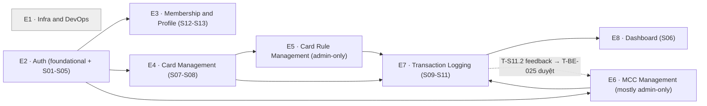

# Task & Subtask Backlog — Phase 1
# CardPilot

**Version:** 2.0
**Date:** 2026-07-25
**Phạm vi:** Chỉ **Phase 1** (MVP — Local-first + Core Tracking). Phase 2 chưa nằm trong backlog này — xem [`deployment-phase-2.md`](./deployment/deployment-phase-2.md) mục 5 tạm thời, sẽ tách theo cùng cấu trúc khi team quyết định mở rộng.
**Nguồn:** Cấu trúc lại từ mục 5 "Task Breakdown" của [`deployment-phase-1.md`](./deployment/deployment-phase-1.md), đối chiếu `BRD`/`PRD`/`SRS`/`ARCH-*` + 13 màn hình đã có prototype tương tác tại [`../prototypes/prototype.html`](../prototypes/prototype.html).
**Trạng thái tổng thể:** Backlog — chưa có task nào bên dưới đã implement (application layer Phase 1 chưa build).

> **Thay đổi lớn so với version 1.x**: Task giờ tổ chức theo **màn hình** (`T-S01`...`T-S13`) cho mọi Epic user-facing, thay vì theo từng API/lớp kỹ thuật rời rạc. Mỗi task = 1 folder riêng (`epic-NN-slug/T-ID-slug/`), gồm `README.md` (mô tả, **acceptance criteria**, dependencies, ref docs **bấm được**, link **prototype** trực tiếp tới đúng màn hình) + 1 file/subtask theo module. Lý do và quy tắc đầy đủ: [`task-template.md`](../template/processes/task-template.md).

---

## 1. Module Legend

| Mã Module | Tên đầy đủ | Phạm vi (thư mục / app thật) | Git commit scope |
|-----------|-----------|-------------------------------|-------------------|
| `BE` | Backend | `apps/cardpilot-backend/src` (NestJS + Fastify + TypeORM) | `backend` |
| `MOBILE` | Mobile App | `apps/cardpilot-mobile/apps/cardpilot_app` (Flutter) | `mobile` |
| `UI` | Shared UI / Design System | `apps/cardpilot-mobile/packages/cardpilot_ui` + `apps/cardpilot-mobile/apps/cardpilot_widgetbook` | `mobile` |
| `AI` | AI/ML Pipeline | Cross-cutting, code nằm trong `BE` (chưa có service riêng) | `backend` |
| `DEVOPS` | DevOps / Infra / CI-CD | `.github/workflows/`, `Dockerfile`, `compose.yaml` | `infra`/`ci` |
| `DATA` | Data Collection / Seeding | Thu thập thủ công + seed script (chưa có thư mục cố định) | `backend` |
| `QA` | Quality Assurance / Testing | Test suite từng app | theo module đang test |

> Dự án **không có** web frontend/admin panel (`FE`) — các Epic Admin-only (5, 6) chưa có UI, chỉ có REST endpoint. Xem ghi chú Gap trong từng task liên quan.

## 2. Quy Ước ID & Dependency (tóm tắt — đầy đủ ở `task-template.md`)

- **Task = màn hình** (`T-S01`...`T-S13`) cho Epic có UI; **Task = capability độc lập** (`T-{MODULE}-{NNN}`, global, không reset theo phase/epic) cho việc dùng chung nhiều màn hình (foundational) hoặc Epic admin-only/infra.
- **Subtask** = `{ID cha}.{n}`, nằm cùng folder với task cha, module có thể khác task cha.
- **Depends On (Task)**: ID cụ thể, trỏ tự do xuyên epic. **Depends On (Phase Gate)**: chỉ dùng khi blocker là mốc release cả phase — không xuất hiện trong Phase 1 (chưa có phase trước để chờ).
- **Status** suy ra tự động: `Ready` nếu không có `Depends On (Task)`, ngược lại `Backlog`.

## 3. Prototype

Toàn bộ 13 màn hình đã có bản mô phỏng tương tác tại [`../prototypes/prototype.html`](../prototypes/prototype.html) — mở file, panel bên trái liệt kê S01→S13, tap để xem thử. Link trực tiếp `prototype.html#view-sNN` (hoặc `#sNN`) trong mỗi task tự động nhảy tới đúng màn hình khi mở file (đã thêm hỗ trợ đọc `location.hash`).

---

## 4. Task Index (theo Epic)

> Link ID mở `README.md` chi tiết (mô tả, acceptance criteria, dependencies, ref docs, prototype, subtasks, audit trail).

### Epic 1: Infrastructure & DevOps Hardening
*(không có màn hình)*

| ID | Task | Module | Status | Depends On (Task) |
|----|------|--------|--------|---------------------|
| [T-DEVOPS-001](./tasks/phase-1/epic-01-infra-devops/T-DEVOPS-001-ci-pull-request/README.md) | CI trên Pull Request | `DEVOPS` | Ready | — |
| [T-BE-001](./tasks/phase-1/epic-01-infra-devops/T-BE-001-structured-logging/README.md) | Structured logging | `BE` | Ready | — |
| [T-BE-002](./tasks/phase-1/epic-01-infra-devops/T-BE-002-global-validation-pipe/README.md) | Global validation pipe | `BE` | Ready | — |
| [T-BE-003](./tasks/phase-1/epic-01-infra-devops/T-BE-003-global-error-handler/README.md) | Global error handler | `BE` | Backlog | T-BE-002 |

### Epic 2: Authentication & Authorization
*Foundational (không màn hình) + Screens S01-S05*

| ID | Task | Module | Status | Depends On (Task) |
|----|------|--------|--------|---------------------|
| [T-BE-004](./tasks/phase-1/epic-02-auth/T-BE-004-quyet-dinh-auth-provider/README.md) | Supabase Auth architecture decision | `BE` | In Progress | — |
| [T-BE-009](./tasks/phase-1/epic-02-auth/T-BE-009-auth-guard-rbac/README.md) | Auth Guard + RBAC | `BE` | Backlog | T-S03.1 |
| [T-BE-010](./tasks/phase-1/epic-02-auth/T-BE-010-refresh-token-storage/README.md) | Custom refresh token storage | `BE` | Not Required | T-BE-004 |
| [T-MOBILE-001](./tasks/phase-1/epic-02-auth/T-MOBILE-001-core-network-api-client/README.md) | core/network — API client | `MOBILE` | Backlog | T-BE-009 |
| [T-MOBILE-008](./tasks/phase-1/epic-02-auth/T-MOBILE-008-local-only-mode/README.md) | Local-only mode | `MOBILE` | In Progress | — |
| [T-S01](./tasks/phase-1/epic-02-auth/T-S01-splash-screen/README.md) | Splash Screen | `MOBILE` (1 subtask) | Backlog | T-MOBILE-001 |
| [T-S02](./tasks/phase-1/epic-02-auth/T-S02-onboarding-screen/README.md) | Remove Onboarding / Start At Sign In | `MOBILE` (1 subtask) | Done | — |
| [T-S03](./tasks/phase-1/epic-02-auth/T-S03-login-screen/README.md) | Login Screen | `MOBILE` (3 subtask: BE/MOBILE/QA) | In Progress | T-MOBILE-001 |
| [T-S04](./tasks/phase-1/epic-02-auth/T-S04-register-screen/README.md) | Register Screen | `MOBILE` (4 subtask: BE/BE/MOBILE/QA) | In Progress | T-MOBILE-001 |
| [T-S05](./tasks/phase-1/epic-02-auth/T-S05-forgot-password-screen/README.md) | Forgot Password Screen | `MOBILE` (2 subtask: BE/MOBILE) | Backlog | T-MOBILE-001 |

### Epic 3: Membership & Profile
*Screens S12-S13 + data*

| ID | Task | Module | Status | Depends On (Task) |
|----|------|--------|--------|---------------------|
| [T-DATA-001](./tasks/phase-1/epic-03-membership-profile/T-DATA-001-seed-memberships/README.md) | Seed memberships | `DATA` | Backlog | T-BE-004 |
| [T-S12](./tasks/phase-1/epic-03-membership-profile/T-S12-profile-screen/README.md) | Profile Screen | `MOBILE` (4 subtask: BE/BE/MOBILE/QA) | In Progress | T-MOBILE-001 |
| [T-S13](./tasks/phase-1/epic-03-membership-profile/T-S13-edit-profile-screen/README.md) | Edit Profile Screen (bổ sung gap PATCH) | `MOBILE` (2 subtask: BE/MOBILE) | Backlog | T-S12.1 |

### Epic 4: Card Management
*Screens S07-S08 + data*

| ID | Task | Module | Status | Depends On (Task) |
|----|------|--------|--------|---------------------|
| [T-DATA-002](./tasks/phase-1/epic-04-card-management/T-DATA-002-thu-thap-banks-credit-cards/README.md) | Thu thập dữ liệu banks + credit_cards | `DATA` | Ready | — |
| [T-S07](./tasks/phase-1/epic-04-card-management/T-S07-add-edit-card-screen/README.md) | Add/Edit Card Screen | `MOBILE` (5 subtask: BE/BE/BE/MOBILE/QA) | Backlog | T-MOBILE-001 |
| [T-S08](./tasks/phase-1/epic-04-card-management/T-S08-card-list-screen/README.md) | Card List Screen | `MOBILE` (3 subtask: BE/BE/MOBILE) | Backlog | T-MOBILE-001 |

### Epic 5: Card Rule Management
*Admin-only, không có màn hình (dự án chưa có module `FE`)*

| ID | Task | Module | Status | Depends On (Task) |
|----|------|--------|--------|---------------------|
| [T-DATA-003](./tasks/phase-1/epic-05-card-rule-management/T-DATA-003-thu-thap-chinh-sach-hoan-tien/README.md) | Thu thập chính sách hoàn tiền | `DATA` | Backlog | T-DATA-002 |
| [T-BE-019](./tasks/phase-1/epic-05-card-rule-management/T-BE-019-admin-crud-reward-rules/README.md) | Admin CRUD reward_rules (2 subtask) | `BE` | Backlog | T-BE-009, T-DATA-003 |
| [T-BE-020](./tasks/phase-1/epic-05-card-rule-management/T-BE-020-admin-gan-mcc-cho-rule/README.md) | Admin gán MCC cho rule | `BE` | Backlog | T-BE-019.1 |
| [T-BE-021](./tasks/phase-1/epic-05-card-rule-management/T-BE-021-user-xem-rule-cua-the/README.md) | User xem rule của thẻ ⚠️ gap: chưa rõ màn hình tiêu thụ | `BE` | Backlog | T-BE-019.1 |

### Epic 6: MCC Management
*Chủ yếu Admin-only; T-AI-001 là foundational cho S09 (Epic 7)*

| ID | Task | Module | Status | Depends On (Task) |
|----|------|--------|--------|---------------------|
| [T-DATA-004](./tasks/phase-1/epic-06-mcc-management/T-DATA-004-seed-mcc/README.md) | Seed merchant_category_codes | `DATA` | Ready | — |
| [T-BE-022](./tasks/phase-1/epic-06-mcc-management/T-BE-022-admin-crud-mcc/README.md) | Admin CRUD MCC | `BE` | Backlog | T-BE-009, T-DATA-004 |
| [T-AI-001](./tasks/phase-1/epic-06-mcc-management/T-AI-001-merchant-lookup-normalize/README.md) | Merchant lookup + normalize | `AI` | Ready | — |
| [T-BE-023](./tasks/phase-1/epic-06-mcc-management/T-BE-023-mcc-candidate-crud-admin/README.md) | MCC candidate CRUD (Admin) | `BE` | Backlog | T-AI-001 |
| [T-BE-025](./tasks/phase-1/epic-06-mcc-management/T-BE-025-admin-duyet-feedback/README.md) | Admin duyệt feedback | `BE` | Backlog | T-BE-023, T-S11.2 |

### Epic 7: Transaction Logging
*Screens S09-S11*

| ID | Task | Module | Status | Depends On (Task) |
|----|------|--------|--------|---------------------|
| [T-S09](./tasks/phase-1/epic-07-transaction-logging/T-S09-add-transaction-screen/README.md) | Add Transaction Screen | `MOBILE` (5 subtask: BE/AI/BE/MOBILE/QA) | Backlog | T-S07.2, T-AI-001 |
| [T-S10](./tasks/phase-1/epic-07-transaction-logging/T-S10-transaction-history-screen/README.md) | Transaction History Screen | `MOBILE` (2 subtask: BE/MOBILE) | Backlog | T-MOBILE-001 |
| [T-S11](./tasks/phase-1/epic-07-transaction-logging/T-S11-transaction-detail-screen/README.md) | Transaction Detail Screen | `MOBILE` (4 subtask: BE/BE/MOBILE/QA) | Backlog | T-S10.1 |

### Epic 8: Dashboard (Core)
*Screen S06*

| ID | Task | Module | Status | Depends On (Task) |
|----|------|--------|--------|---------------------|
| [T-S06](./tasks/phase-1/epic-08-dashboard/T-S06-dashboard-screen/README.md) | Dashboard Screen | `MOBILE` (6 subtask: BE/BE/UI/UI/MOBILE/QA) | Backlog | T-MOBILE-001 |

---

## 5. Dependency Graph (Epic-level)

> **Ghi nhận trung thực**: Epic 1 (Infra & DevOps) không có cạnh nối vào epic khác — không task nào trong `deployment-phase-1.md` gốc khai báo phụ thuộc kỹ thuật vào CI/structured logging/validation pipe, dù nên áp dụng cho mọi API mới. Gap trong task breakdown gốc, không phải lỗi khi chuyển đổi.

> **Critical path hiện tại**: `T-BE-004 (identity mapping) → T-BE-009 (Supabase token verification/Auth Guard) → T-S03.1 (user bootstrap) → T-MOBILE-001 (network client) → các feature cần cloud data`. Mobile Sign in/Sign up/guest/setup/Home shell đã có thể tiếp tục độc lập; blocker còn lại áp dụng cho backend profile và đồng bộ cloud.

## 6. Module × Epic Matrix

| Epic | BE | MOBILE | UI | AI | DEVOPS | DATA | QA |
|------|----|--------|----|----|--------|------|-----|
| E1 · Infra & DevOps | ✅ | — | — | — | ✅ | — | — |
| E2 · Auth | ✅ | ✅ | — | — | — | — | ✅ |
| E3 · Membership & Profile | ✅ | ✅ | — | — | — | ✅ | ✅ |
| E4 · Card Management | ✅ | ✅ | — | — | — | ✅ | ✅ |
| E5 · Card Rule Management | ✅ | — | — | — | — | ✅ | — |
| E6 · MCC Management | ✅ | — | — | ✅ | — | ✅ | — |
| E7 · Transaction Logging | ✅ | ✅ | — | ✅ | — | — | ✅ |
| E8 · Dashboard | ✅ | ✅ | ✅ | — | — | — | ✅ |

## 7. Tham Chiếu Tài Liệu

| Tài liệu | Sections liên quan |
|-----------|-------------------|
| **BRD** | #3.2 (Local-only mode), #6.1-6.6 (Core Features) |
| **PRD** | #2.1-2.7 (modules), #4 (User Flows), #5 (Phase 1 Must Have) |
| **SRS** | 3.1-3.8 (FR-AUTH, FR-MEMBER, FR-CARD, FR-RULE, FR-MCC, FR-TXN, FR-DASH), NFR-MAINT-04, NFR-SEC-04/05/06 |
| **ARCH-SYS** | Bounded Context, Security |
| **ARCH-API** | 1.2 (Response Format), 4-9 (endpoint groups) |
| **ARCH-DB** | 2.2 (Table Definitions) |
| **ARCH-AI** | 3 (MCC Inference) |
| **ARCH-DS** | Component Inventory |
| **PROC-CICD** | Known Gap (CI trên PR), Environment & Secrets |
| **Prototype** | [`../prototypes/prototype.html`](../prototypes/prototype.html) — 13/13 màn hình Phase 1 |
| **deployment-phase-1.md** | Mục 5 "Task Breakdown" gốc (nguồn của file này) |
