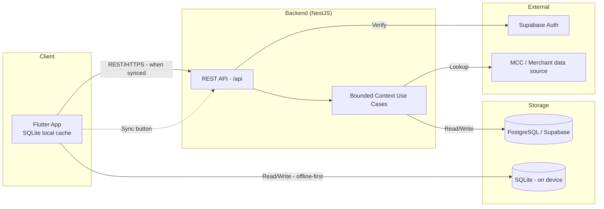

# Template: deployment-phases.md (Overview)

> File này quy định cấu trúc cho `docs/processes/deployment-phases.md`.
> Đây là file tổng quan roadmap, KHÔNG chứa chi tiết từng phase.

---

## Cấu trúc bắt buộc

```markdown
# Deployment Phases - Tổng Quan Roadmap Triển Khai
# CardPilot

**Version:** {X.X}
**Date:** {YYYY-MM-DD}

---

## Roadmap Overview
<!-- Bảng hoặc ASCII timeline diagram hiển thị các phases -->

---

## Quy Ước Tham Chiếu
<!-- Bảng viết tắt → tài liệu → đường dẫn -->
<!-- Mỗi doc trong docs/ được mapping 1 viết tắt -->

| Viết tắt | Tài liệu | Đường dẫn |
|----------|-----------|-----------|
| ... | ... | ... |

---

## Phase Summary
<!-- Bảng tóm tắt mỗi phase, link tới chi tiết -->
<!-- KHÔNG chứa cost/revenue — chỉ goal, users, timeline -->
<!-- Key Tables: liệt kê 2-4 tables chính được tạo/thay đổi trong phase -->

| Phase | Goal | Users | Key Tables | Timeline | Chi tiết |
|-------|------|-------|------------|----------|----------|
| ... | ... | ... | {table_1, table_2, ...} | ... | [→ phase-X/](...) |

---

## Technology Evolution
<!-- Ma trận công nghệ theo phase -->
<!-- Ghi rõ tech MỚI thêm ở mỗi phase (dùng "+") -->

| Component | Phase 1 | Phase 2 | ... |
|-----------|---------|---------|-----|
| ... | ... | ... | ... |

---

## Database Evolution
<!-- Ma trận tables/entities được tạo hoặc thay đổi qua từng phase -->
<!-- Quy tắc: -->
<!--   - "New" = table mới được tạo trong phase đó -->
<!--   - "+field" = table có thêm field mới -->
<!--   - "~" = table bị modify (alter column, add constraint) -->
<!--   - "—" = không thay đổi -->
<!--   - Giúp DBA/Tech Lead nhìn tổng thể DB growth mà không mở từng phase-detail -->

| Table / Entity | Phase 1 | Phase 2 | ... | Total Fields |
|----------------|---------|---------|-----|--------------|
| users | New | +avatar_url | ... | {N} |
| transactions | New | +tags | ... | {N} |
| ... | ... | ... | ... | ... |

**Tổng tables tích lũy:**
| Phase | New Tables | Modified | Cumulative |
|-------|-----------|----------|------------|
| 1 | {N} | — | {N} |
| 2 | {N} | {N} | {N} |
| ... | ... | ... | ... |

---

## Data Flow Overview
<!-- Mermaid diagram tổng thể: data chảy giữa mobile app, backend, Supabase/Postgres, SQLite cache -->
<!-- Mục tiêu: bird-eye view — thấy được data source → processing → storage → output -->
<!-- KHÔNG chi tiết từng field/API — chỉ thể hiện direction và protocol -->



> Diagram này là **logical view** — không thể hiện infrastructure chi tiết (load balancer, replica, etc.). Xem `ARCH-SYS` cho physical deployment.

---

## Module × Phase Matrix
<!-- Ma trận modules được build ở phase nào -->
<!-- ✅/Core = build mới, text = Enhancement -->

| Module | Phase 1 | Phase 2 | ... |
|--------|---------|---------|-----|
| ... | ... | ... | ... |

---

## Folder Structure
<!-- Cây thư mục project structure liên quan deployment -->
```

---

## Quy tắc

1. File này chỉ là **index/overview** — KHÔNG viết chi tiết tasks, API, screens
2. Mỗi phase link tới `docs/processes/deployment/deployment-phase-X.md`
3. Không chứa: Cost, Revenue projections, Success Criteria, Deployment Architecture diagrams
4. Giữ ngắn gọn, dưới 150 lines
5. **Database Evolution** — chỉ ghi table name + change indicator, KHÔNG ghi field detail (detail nằm ở phase-detail)
6. **Data Flow** — chỉ mermaid diagram logical, KHÔNG ghi connection string hay config
