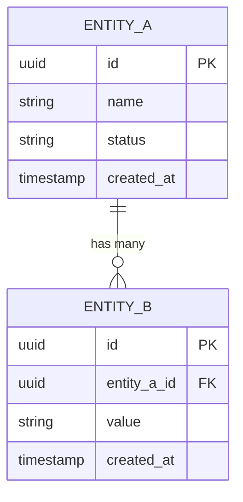

# Template: phase-X/README.md (Chi tiết từng Phase)

> File này quy định cấu trúc cho mỗi `docs/processes/deployment/deployment-phase-X.md`.
> Mục tiêu: break tasks, xác định dependency, liệt kê screens & API.

---

## Cấu trúc bắt buộc

```markdown
# Phase {N} - {Tên Phase}
# CardPilot

**Status:** {Planned | In Progress | Done}
**Timeline:** {X tháng}
**Goal:** {1 câu mô tả mục tiêu phase}
**User Scale:** {X → Y}

---

## 1. Technology Stack

<!-- Bảng công nghệ sử dụng trong phase này -->
<!-- Chỉ liệt kê tech THỰC SỰ dùng, không liệt kê tech tương lai -->

| Component | Technology |
|-----------|-----------|
| Mobile | ... |
| Backend | ... |
| Database | ... |
| ... | ... |

---

## 2. Screens

<!-- Liệt kê TỪNG màn hình sẽ build trong phase này -->
<!-- Quy tắc: -->
<!--   - ID format: S{NN} (S01, S02, ...) -->
<!--   - Depends On: ghi screen ID hoặc "—" nếu không phụ thuộc -->
<!--   - Mô tả ngắn: WHAT user thấy/làm, không HOW implement -->

| # | Screen | Mô tả | Depends On |
|---|--------|--------|-----------|
| S01 | {Tên screen} | {User thấy/làm gì} | {S-XX hoặc —} |
| S02 | ... | ... | ... |

---

## 3. Database / ERD

<!-- Mô tả data model cho phase này -->
<!-- Quy tắc: -->
<!--   - ERD tham chiếu từ: ARCH-DB (Architecture Database Document) -->
<!--   - Chỉ liệt kê tables/entities MỚI hoặc CÓ THAY ĐỔI trong phase này -->
<!--   - Nếu phase > 1, ghi rõ "New in Phase X" hoặc "Modified in Phase X" -->
<!--   - Diagram dùng Mermaid erDiagram syntax -->

### 3.1. ERD Reference

| Source | Section | Mô tả |
|--------|---------|--------|
| **ARCH-DB** | #{section} | {Phần nào của ARCH-DB liên quan phase này} |
| **SRS** | {FR-XXX} | {Requirement nào drive data model này} |
| **BRD** | #{section} | {Business context cho data model} |

> ERD đầy đủ nằm tại `ARCH-DB`. Dưới đây là **subset** liên quan phase này.

### 3.2. ERD Diagram



### 3.3. Tables / Entities

<!-- Liệt kê từng table mới hoặc có thay đổi -->
<!-- Quy tắc: -->
<!--   - Change Type: New | Modified | Extended -->
<!--   - Key fields: chỉ ghi fields quan trọng (PK, FK, business fields) -->
<!--   - Index: ghi các index cần tạo cho performance -->
<!--   - Constraints: UNIQUE, CHECK, NOT NULL đặc biệt -->

| # | Table / Entity | Change Type | Mô tả | Key Fields | Relationships | Ref |
|---|----------------|-------------|--------|------------|---------------|-----|
| T01 | {table_name} | New | {Mục đích table này} | id (PK), field_1, field_2 | → {parent_table} (FK) | ARCH-DB #{N} |
| T02 | {table_name} | Modified | {Thay đổi gì} | + new_field (added) | — | ARCH-DB #{N} |

### 3.4. Indexes & Constraints

<!-- Liệt kê indexes và constraints đặc biệt cần tạo -->

| Table | Index / Constraint | Type | Columns | Mục đích |
|-------|--------------------|------|---------|----------|
| {table} | idx_{table}_{field} | INDEX | (field_1, field_2) | Query performance cho ... |
| {table} | uq_{table}_{field} | UNIQUE | (field_1) | Business rule: không trùng ... |
| {table} | chk_{table}_{field} | CHECK | field_1 IN (...) | Validate enum values |

### 3.5. Migration Notes

<!-- Ghi chú cho migration scripts -->
<!--   - Thứ tự tạo table (dependency order) -->
<!--   - Seed data nếu có -->
<!--   - Breaking changes nếu phase > 1 -->

- **Create order**: {table_1} → {table_2} → {table_3} (theo FK dependency)
- **Seed data**: {table nào cần seed, data gì}
- **Breaking changes**: {Nếu modify table cũ, ghi rõ backward compatibility}
- **Migration file**: `apps/cardpilot-backend/src/database/migrations/{timestamp}-{name}.ts`

### 3.6. Data Volume & Retention

<!-- Ước lượng data growth cho mỗi table -->
<!-- Quy tắc: -->
<!--   - Ghi estimated rows tại launch và sau 6 tháng / 1 năm -->
<!--   - Growth rate: estimated new rows/day hoặc /month -->
<!--   - Retention: forever / 30d / 90d / 1y / archive-after-X -->
<!--   - Partition strategy: nếu table > 1M rows, ghi rõ partition key -->
<!--   - Ảnh hưởng trực tiếp đến indexing, cost, và backup strategy -->

| Table | Est. Rows (Launch) | Growth Rate | Est. Rows (6mo) | Retention | Partition / Archive |
|-------|-------------------|-------------|-----------------|-----------|---------------------|
| {table_1} | {N} | {X rows/day} | {N} | Forever | — |
| {table_2} | {N} | {X rows/day} | {N} | 90 days | partition by created_at (monthly) |

**Ghi chú**: Tables vượt 1M rows cần có partition strategy hoặc archival plan trước khi deploy.

### 3.7. Local Cache Strategy (Mobile SQLite)

<!-- CardPilot đặc thù: mobile giữ bản sao cục bộ qua SQLite, đồng bộ 2 chiều với Postgres/Supabase -->
<!-- Liệt kê TỪNG table được cache local, mô tả field mapping và chiến lược sync -->
<!-- "—" nếu table không cần local cache trong phase này -->

| Local Table (SQLite) | Nguồn (Postgres) | Sync Direction | Conflict Resolution | Mục đích |
|-----------------------|-------------------|-----------------|----------------------|----------|
| `local_transactions` | transactions | Device → Server (on sync tap) | Last-write-wins theo `updated_at` | Cho phép log giao dịch offline |

### 3.8. Cache Strategy (Backend)

<!-- Cache layer (Redis / in-memory) trên backend, nếu có -->
<!-- "—" nếu phase không dùng cache -->

| Key Pattern | Data Cached | Source Table | TTL | Invalidation Trigger | Mục đích |
|-------------|-------------|--------------|-----|---------------------|----------|
| `—` | — | — | — | — | — |

---

## 4. API Endpoints

<!-- Grouped theo bounded context -->
<!-- Quy tắc: -->
<!--   - Ghi tổng số endpoints mỗi group -->
<!--   - Auth column: — (public), Bearer, Admin -->
<!--   - Related Tables: ghi table(s) mà endpoint đọc/ghi — giúp trace API → DB -->
<!--   - Chỉ liệt kê endpoints MỚI trong phase này -->
<!--   - Nếu phase > 1, ghi rõ "New in Phase X" -->

### {Bounded Context Name} ({count})

| Method | Endpoint | Auth | Related Tables | Mô tả |
|--------|----------|------|----------------|--------|
| POST | `/api/path` | Bearer | {table_1 (W), table_2 (R)} | {Mô tả ngắn} |
| GET | `/api/path/:id` | Bearer | {table_1 (R)} | {Mô tả ngắn} |

> **Convention**: `(R)` = Read, `(W)` = Write, `(RW)` = Read + Write

**Total: {N} endpoints**
**Cumulative (Phase 1→{X}): {M} endpoints**

---

## 5. Task Breakdown

<!-- Phần QUAN TRỌNG NHẤT — break tasks chi tiết -->
<!-- Quy tắc: -->
<!--   - Chia theo Epic (nhóm logic, thường theo bounded context) -->
<!--   - ID format: T-{NNN} (T-001, T-010, ...) — đánh theo Epic -->
<!--   - Deps: "→ T-XXX" = phải hoàn thành trước (blocking dependency) -->
<!--   - Deps: "—" = không phụ thuộc task nào -->
<!--   - Ref Docs: viết tắt theo Quy Ước Tham Chiếu + mục số -->
<!--   - DB Migration: ghi migration file cần tạo (nếu task liên quan DB), "—" nếu không -->
<!--   - Mô tả: viết RÕ scope — input/output/behavior -->

### Epic {N}: {Tên Epic}

| ID | Task | Mô tả | Deps | DB Migration | Ref Docs |
|----|------|--------|------|--------------|----------|
| T-{NNN} | {Tên task} | {Chi tiết: input → processing → output} | → T-{XXX} | {timestamp-name.ts} | {VIẾT-TẮT #section} |

<!-- Lặp lại cho mỗi Epic -->

---

## 6. Dependency Graph

<!-- ASCII diagram hiển thị quan hệ phụ thuộc giữa tasks -->
<!-- Quy tắc: -->
<!--   - Hiển thị critical path (đường dài nhất) -->
<!--   - Group theo layer: Infra → Backend → Mobile -->
<!--   - Dùng cho dependency direction -->

<!-- Nếu phức tạp, tách Backend chain và Mobile chain riêng -->

---

## 7. Tham Chiếu Tài Liệu

<!-- Bảng quick-reference: document → sections liên quan phase này -->

| Tài liệu | Sections liên quan |
|-----------|-------------------|
| **BRD** | #... |
| **PRD** | #... |
| **SRS** | FR-..., NFR-... |
| **ARCH-SYS** | #... |
| **ARCH-API** | #... |
| **ARCH-DB** | #... |
| **ARCH-AI** | #... |
| **PROC-CICD** | #... |
```

---

## Quy tắc viết

### PHẢI có:
1. **Screens** — mỗi screen 1 dòng, ID rõ ràng, dependency chain
2. **Database / ERD** — liệt kê tables mới/thay đổi, ERD diagram (Mermaid), tham chiếu rõ từ ARCH-DB section nào, indexes & constraints, migration order
3. **Task Breakdown** — mỗi task có mô tả cụ thể (không viết "implement X" mà viết rõ X là gì, nhận input gì, trả output gì)
4. **Dependency** — mỗi task ghi rõ blocks-by, để xác định critical path
5. **Ref Docs** — mỗi task trỏ tới docs gốc (VD: `SRS FR-AUTH-03`, `ARCH-API #2`, `ARCH-DB #3`)

### Quy tắc đánh ID:

> Mỗi phase bắt đầu từ T-001 — ID chỉ unique TRONG phase đó.

### Format tham chiếu tài liệu:

Dùng `#` + số mục. Ví dụ:
- `ARCH-API #2` = Architecture API Document, mục 2
- `SRS FR-AUTH-03` = SRS, requirement FR-AUTH-03
- `ARCH-DB #3` = Database Design, mục 3
- `BRD #6.2` = BRD, mục 6.2

### Quy tắc viết mô tả task:

**Sai:**
```
| T-010 | Implement OTP | Implement OTP feature | — | — | SRS |
```

**Đúng:**
```
| T-010 | Email OTP send | POST /api/auth/otp/send — generate 6 digits, store cache key otp:{email}:login (TTL 5min), send email. Return 200 {message} | → T-001, T-002 | — | SRS FR-AUTH-03, ARCH-API #2, ARCH-DB #3 |
```

### Quy tắc viết Screen:

**Sai:**
```
| S01 | Login | Login screen | — |
```

**Đúng:**
```
| S03 | Login | Chọn method: nút "Đăng nhập", nút "Dùng thử không cần tài khoản" (local-only, không sync) | — |
| S04 | Add Card | Chọn ngân hàng + sản phẩm thẻ từ danh sách seed, nhập nickname + billing cycle day | S03 |
```

### Quy tắc viết Database / ERD:

**Sai:**
```
| T01 | users | New | User table | id, name, email | — | ARCH-DB |
```
> ❌ Thiếu data type, thiếu FK relationship, ref chung chung không ghi section number.

**Đúng:**
```
| T01 | users | New | Lưu thông tin tài khoản: profile, phương thức đăng nhập | id (PK, uuid), email (UNIQUE), full_name, born_date, method_login, created_at | — | ARCH-DB #2.2 |
| T02 | user_cards | New | Thẻ tín dụng user đã thêm vào app, liên kết credit_cards + user | id (PK, uuid), user_id (FK → users), credit_card_id (FK → credit_cards), nickname, billing_cycle_day, is_default | → users (FK), → credit_cards (FK) | ARCH-DB #2.2 |
```

**Sai (Task Breakdown — DB Migration column):**
```
| T-001 | Create users table | Create table | — | migration | SRS |
```

**Đúng (Task Breakdown — DB Migration column):**
```
| T-001 | Create users + memberships schema | Migration: tạo bảng users (uuid PK, email UNIQUE) + memberships (name UNIQUE, max_cards) + user_memberships (FK → users, FK → memberships). | — | 1784410000000-create-initial-schema.ts | SRS FR-AUTH-01, ARCH-DB #2.2 |
```
